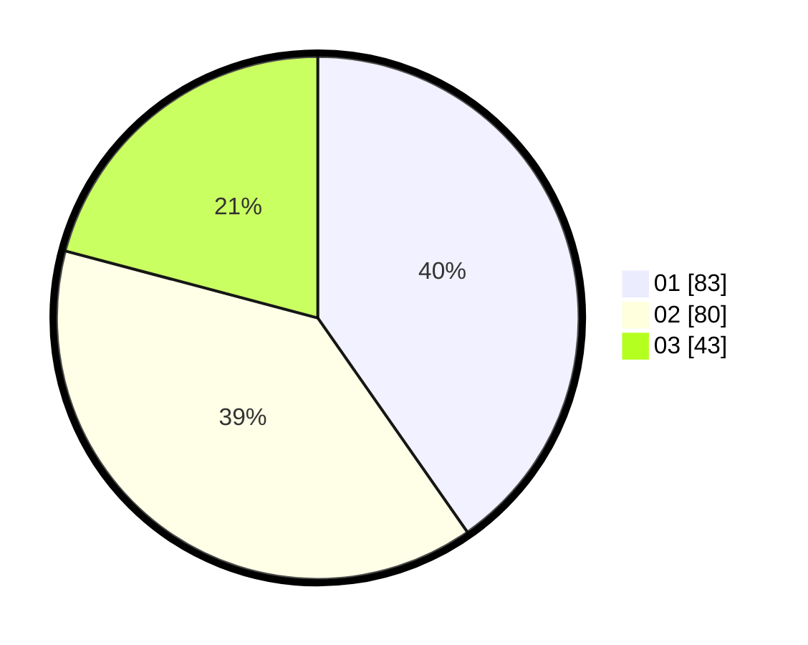

# Hasil

Hasil perolehan suara paslon dapat dilihat pada file paslon-01.txt, paslon-02.txt, dan paslon-03.txt.

Jika tidak ada, artinya data tersebut belum ada pada SIREKAP.

## Perolehan Suara

 * Paslon 01: **83**.
 * Paslon 02: **80**.
 * Paslon 03: **43**.

## Foto C Plano

https://sirekap-obj-formc.kpu.go.id/6533/pemilu/ppwp/31/75/04/10/07/3175041007100-20240214-220651--cf3e70fa-1700-4870-b164-ac86f853a31f.jpg

https://sirekap-obj-formc.kpu.go.id/6533/pemilu/ppwp/31/75/04/10/07/3175041007100-20240216-080516--21a00533-d712-4446-94a5-f67bf098f899.jpg

https://sirekap-obj-formc.kpu.go.id/6533/pemilu/ppwp/31/75/04/10/07/3175041007100-20240216-080514--606229ab-b35c-40ea-9ed7-ed7fff33113b.jpg
