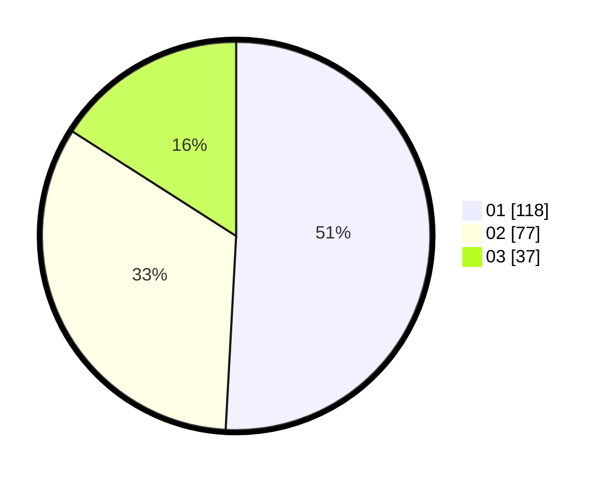

# Hasil

Hasil perolehan suara paslon dapat dilihat pada file paslon-01.txt, paslon-02.txt, dan paslon-03.txt.

Jika tidak ada, artinya data tersebut belum ada pada SIREKAP.

## Perolehan Suara

 * Paslon 01: **118**.
 * Paslon 02: **77**.
 * Paslon 03: **37**.

## Foto C Plano

https://sirekap-obj-formc.kpu.go.id/a172/pemilu/ppwp/31/75/04/10/07/3175041007107-20240219-073413--e044a283-e61b-44f0-bdee-a91056997fa1.jpg

https://sirekap-obj-formc.kpu.go.id/a172/pemilu/ppwp/31/75/04/10/07/3175041007107-20240219-073842--1067fee8-b0b3-418f-b464-cf001baf218c.jpg

https://sirekap-obj-formc.kpu.go.id/a172/pemilu/ppwp/31/75/04/10/07/3175041007107-20240219-074003--f9848fd0-6a1b-47cd-9377-6adaa55d50d8.jpg

## DATA PEMILIH TETAP

Jumlah pemilih dalam DPT: **275**.
 * L: **138**.
 * P: **137**.

## DATA PENGGUNA HAK PILIH

Jumlah pengguna hak pilih dalam DPT: **221**.
 * L: **108**.
 * P: **113**.

Jumlah pengguna hak pilih dalam DPTb: **2**.
 * L: **1**.
 * P: **1**.

Jumlah pengguna hak pilih dalam DPK: **7**.
 * L: **3**.
 * P: **4**.

Jumlah pengguna hak pilih: **230**.
 * L: **112**.
 * P: **118**.

## JUMLAH SUARA SAH DAN TIDAK SAH

JUMLAH SELURUH SUARA SAH: **226**.

JUMLAH SUARA TIDAK SAH: **4**.

JUMLAH SELURUH SUARA SAH DAN SUARA TIDAK SAH: **230**.
