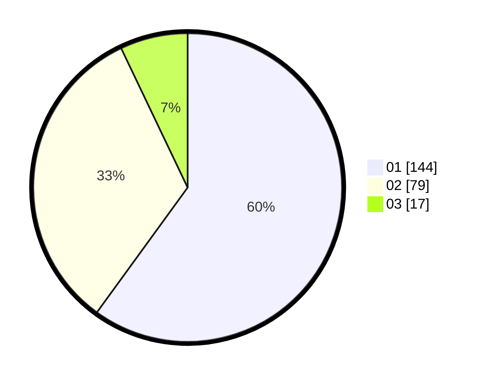

# Hasil

Hasil perolehan suara paslon dapat dilihat pada file paslon-01.txt, paslon-02.txt, dan paslon-03.txt.

Jika tidak ada, artinya data tersebut belum ada pada SIREKAP.

## Perolehan Suara

 * Paslon 01: **144**.
 * Paslon 02: **79**.
 * Paslon 03: **17**.

## Foto C Plano

https://sirekap-obj-formc.kpu.go.id/a652/pemilu/ppwp/31/75/05/10/01/3175051001004-20240214-192247--98524dc2-6e52-493e-b939-286d46e38a7c.jpg

https://sirekap-obj-formc.kpu.go.id/a652/pemilu/ppwp/31/75/05/10/01/3175051001004-20240214-155833--7f9cef3d-9873-4f50-be52-a8d46cdf5049.jpg

https://sirekap-obj-formc.kpu.go.id/a652/pemilu/ppwp/31/75/05/10/01/3175051001004-20240214-160118--e0bb63f8-4e8e-41ee-95d4-854b42aa5944.jpg

## DATA PEMILIH TETAP

Jumlah pemilih dalam DPT: **271**.
 * L: **127**.
 * P: **144**.

## DATA PENGGUNA HAK PILIH

Jumlah pengguna hak pilih dalam DPT: **225**.
 * L: **101**.
 * P: **124**.

Jumlah pengguna hak pilih dalam DPTb: **11**.
 * L: **7**.
 * P: **4**.

Jumlah pengguna hak pilih dalam DPK: **5**.
 * L: **4**.
 * P: **1**.

Jumlah pengguna hak pilih: **241**.
 * L: **112**.
 * P: **129**.

## JUMLAH SUARA SAH DAN TIDAK SAH

JUMLAH SELURUH SUARA SAH: **240**.

JUMLAH SUARA TIDAK SAH: **1**.

JUMLAH SELURUH SUARA SAH DAN SUARA TIDAK SAH: **241**.
