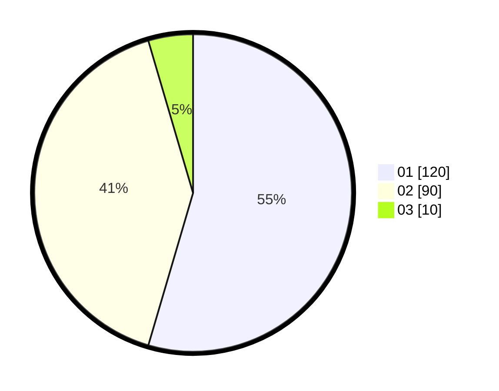

# Hasil

Hasil perolehan suara paslon dapat dilihat pada file paslon-01.txt, paslon-02.txt, dan paslon-03.txt.

Jika tidak ada, artinya data tersebut belum ada pada SIREKAP.

## Perolehan Suara

 * Paslon 01: **120**.
 * Paslon 02: **90**.
 * Paslon 03: **10**.

## Foto C Plano

https://sirekap-obj-formc.kpu.go.id/6dd7/pemilu/ppwp/31/75/05/10/01/3175051001005-20240215-004326--d868ffd6-8412-4a58-9134-ce87769f608d.jpg

https://sirekap-obj-formc.kpu.go.id/6dd7/pemilu/ppwp/31/75/05/10/01/3175051001005-20240214-214353--f1c20438-7141-4590-957b-613598368a32.jpg
