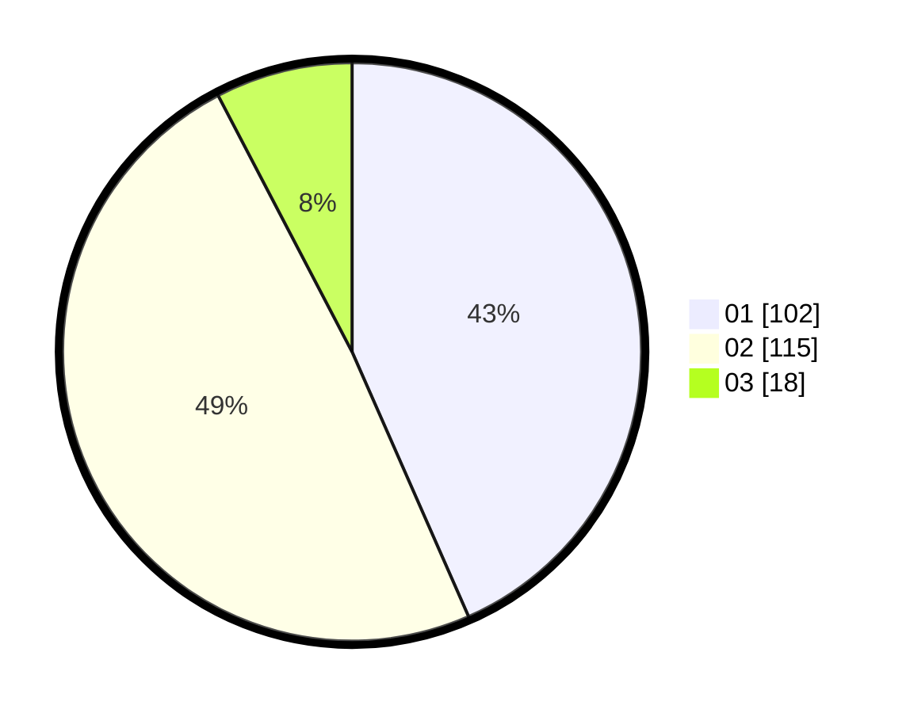

# Hasil

Hasil perolehan suara paslon dapat dilihat pada file paslon-01.txt, paslon-02.txt, dan paslon-03.txt.

Jika tidak ada, artinya data tersebut belum ada pada SIREKAP.

## Perolehan Suara

 * Paslon 01: **102**.
 * Paslon 02: **115**.
 * Paslon 03: **18**.

## Foto C Plano

https://sirekap-obj-formc.kpu.go.id/a7e1/pemilu/ppwp/31/75/05/10/01/3175051001006-20240214-194359--0b4328cc-8ea6-4ea5-b225-48e6d3d1b8b5.jpg

https://sirekap-obj-formc.kpu.go.id/a7e1/pemilu/ppwp/31/75/05/10/01/3175051001006-20240214-194452--9fced880-3b81-4fe7-bd95-86900c080e08.jpg

https://sirekap-obj-formc.kpu.go.id/a7e1/pemilu/ppwp/31/75/05/10/01/3175051001006-20240214-194529--3d9750a5-cca1-4508-965e-cbaa08750def.jpg
