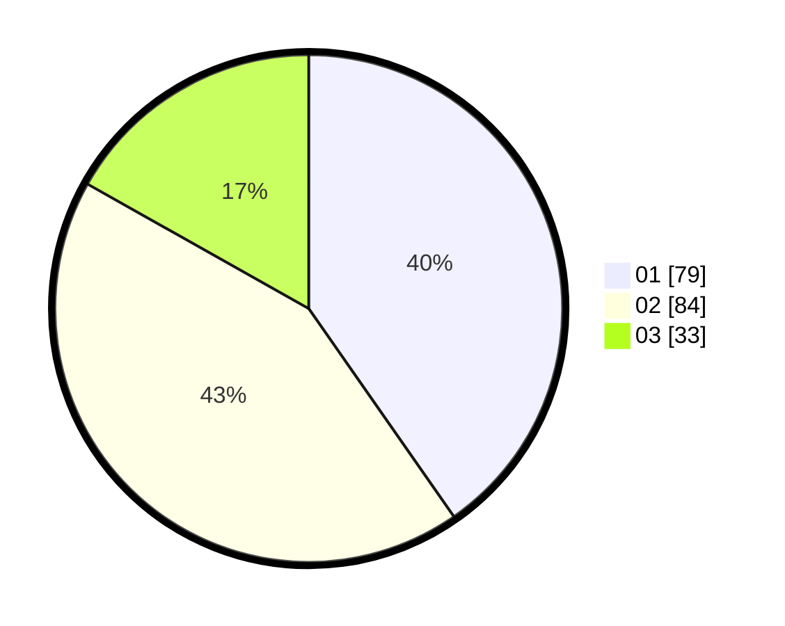

# Hasil

Hasil perolehan suara paslon dapat dilihat pada file paslon-01.txt, paslon-02.txt, dan paslon-03.txt.

Jika tidak ada, artinya data tersebut belum ada pada SIREKAP.

## Perolehan Suara

 * Paslon 01: **79**.
 * Paslon 02: **84**.
 * Paslon 03: **33**.

## Foto C Plano

https://sirekap-obj-formc.kpu.go.id/bd74/pemilu/ppwp/31/75/05/10/01/3175051001012-20240214-214433--19f5be26-afdf-4ffa-b076-efcc96770db9.jpg

https://sirekap-obj-formc.kpu.go.id/bd74/pemilu/ppwp/31/75/05/10/01/3175051001012-20240214-203956--548e163b-5856-4cbf-a4f7-610e65cdd62d.jpg

https://sirekap-obj-formc.kpu.go.id/bd74/pemilu/ppwp/31/75/05/10/01/3175051001012-20240214-204112--2ecdc82a-f9a5-48ea-baa7-acfe2d7d2bce.jpg
