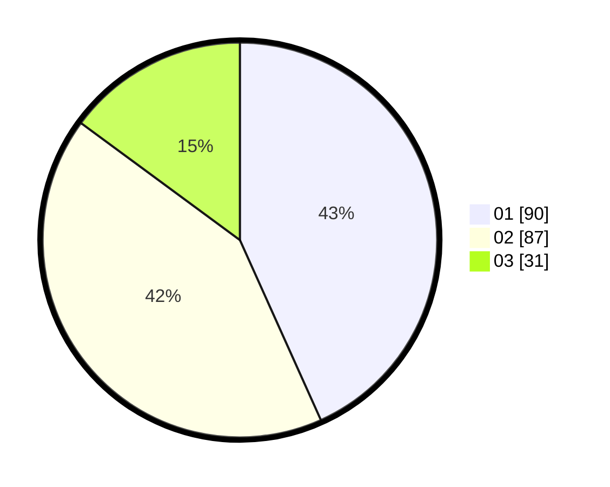

# Hasil

Hasil perolehan suara paslon dapat dilihat pada file paslon-01.txt, paslon-02.txt, dan paslon-03.txt.

Jika tidak ada, artinya data tersebut belum ada pada SIREKAP.

## Perolehan Suara

 * Paslon 01: **90**.
 * Paslon 02: **87**.
 * Paslon 03: **31**.

## Foto C Plano

https://sirekap-obj-formc.kpu.go.id/904e/pemilu/ppwp/31/75/05/10/01/3175051001014-20240215-010701--eaf0446e-8421-4034-87ae-66b178b87be3.jpg

https://sirekap-obj-formc.kpu.go.id/904e/pemilu/ppwp/31/75/05/10/01/3175051001014-20240215-011009--b6662a76-bc1b-4f7f-8e30-87b6da29398c.jpg

https://sirekap-obj-formc.kpu.go.id/904e/pemilu/ppwp/31/75/05/10/01/3175051001014-20240215-011228--af76016f-ea52-4ae5-a579-b9d734acea3d.jpg
