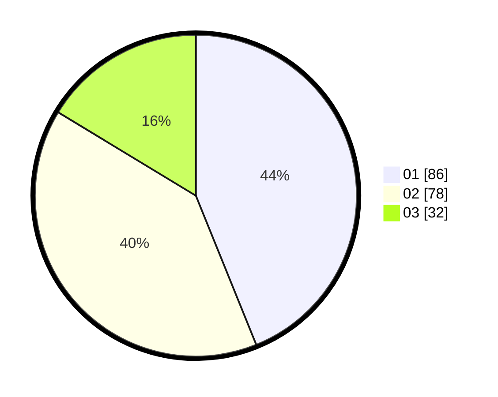

# Hasil

Hasil perolehan suara paslon dapat dilihat pada file paslon-01.txt, paslon-02.txt, dan paslon-03.txt.

Jika tidak ada, artinya data tersebut belum ada pada SIREKAP.

## Perolehan Suara

 * Paslon 01: **86**.
 * Paslon 02: **78**.
 * Paslon 03: **32**.

## Foto C Plano

https://sirekap-obj-formc.kpu.go.id/31f4/pemilu/ppwp/31/75/05/10/01/3175051001016-20240214-211817--87de5047-3a90-451f-8820-9b102872b011.jpg

https://sirekap-obj-formc.kpu.go.id/31f4/pemilu/ppwp/31/75/05/10/01/3175051001016-20240214-211942--6407955f-1dc6-4236-b2bb-5b0733d4d2ef.jpg

https://sirekap-obj-formc.kpu.go.id/31f4/pemilu/ppwp/31/75/05/10/01/3175051001016-20240214-212112--2e2753cb-2c89-4263-80a7-b6e33102bd5c.jpg
