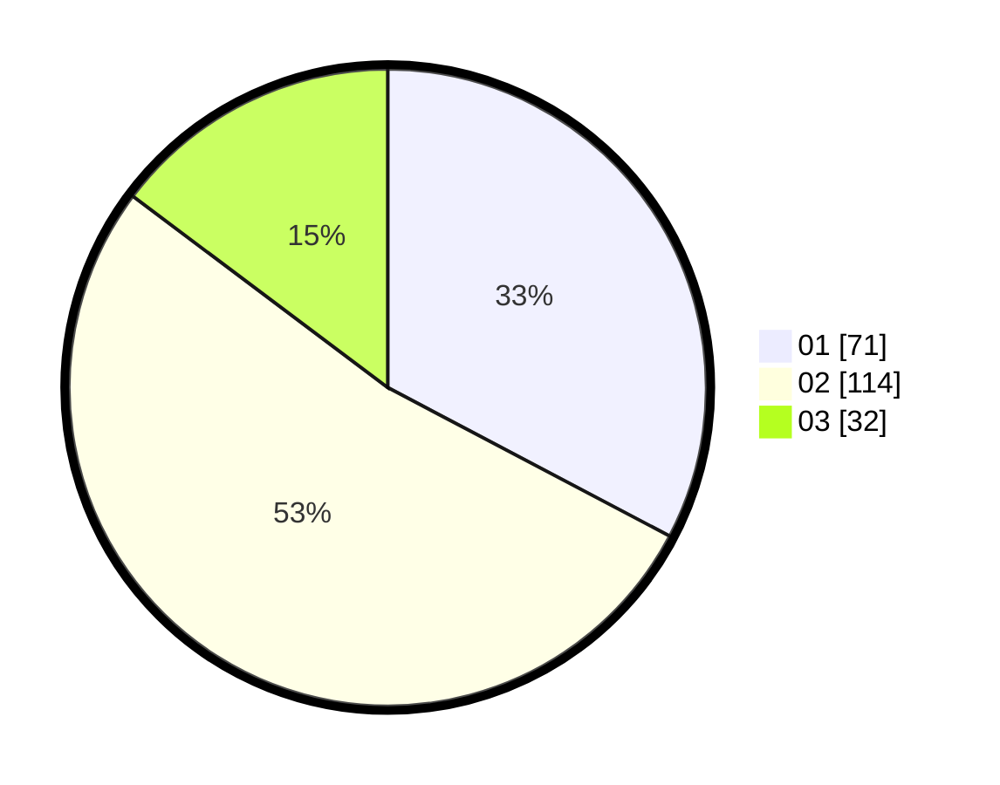

# Hasil

Hasil perolehan suara paslon dapat dilihat pada file paslon-01.txt, paslon-02.txt, dan paslon-03.txt.

Jika tidak ada, artinya data tersebut belum ada pada SIREKAP.

## Perolehan Suara

 * Paslon 01: **71**.
 * Paslon 02: **114**.
 * Paslon 03: **32**.

## Foto C Plano

https://sirekap-obj-formc.kpu.go.id/45f0/pemilu/ppwp/31/75/05/10/01/3175051001025-20240214-222310--88bf0209-f2f3-4405-b387-87638b9da18d.jpg

https://sirekap-obj-formc.kpu.go.id/45f0/pemilu/ppwp/31/75/05/10/01/3175051001025-20240214-214420--687fe199-5880-4bfb-9718-e0f78d4a7641.jpg

https://sirekap-obj-formc.kpu.go.id/45f0/pemilu/ppwp/31/75/05/10/01/3175051001025-20240214-222705--9b4b3057-06de-4d74-acc5-70448b249c53.jpg
