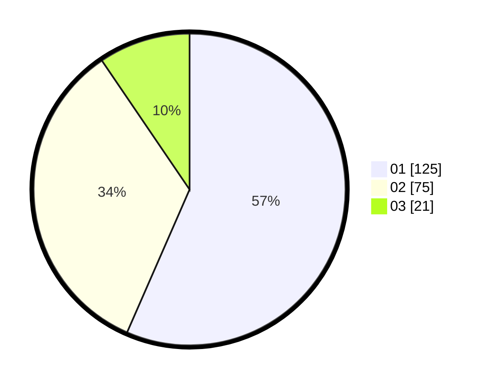

# Hasil

Hasil perolehan suara paslon dapat dilihat pada file paslon-01.txt, paslon-02.txt, dan paslon-03.txt.

Jika tidak ada, artinya data tersebut belum ada pada SIREKAP.

## Perolehan Suara

 * Paslon 01: **125**.
 * Paslon 02: **75**.
 * Paslon 03: **21**.

## Foto C Plano

https://sirekap-obj-formc.kpu.go.id/e268/pemilu/ppwp/31/75/05/10/01/3175051001028-20240214-200122--1f53cd8c-b0b6-4830-b470-a4efe95815d6.jpg

https://sirekap-obj-formc.kpu.go.id/e268/pemilu/ppwp/31/75/05/10/01/3175051001028-20240214-200000--56be5dbb-4f03-4376-8dda-0dee8909fde8.jpg

https://sirekap-obj-formc.kpu.go.id/e268/pemilu/ppwp/31/75/05/10/01/3175051001028-20240214-200228--9093b510-887a-4183-8a4d-8afe10fe3cd7.jpg
