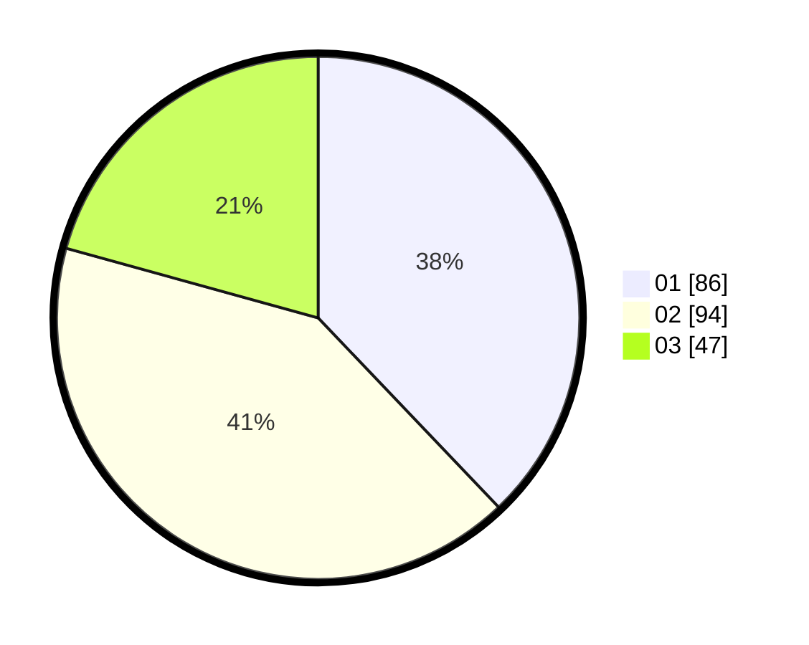

# Hasil

Hasil perolehan suara paslon dapat dilihat pada file paslon-01.txt, paslon-02.txt, dan paslon-03.txt.

Jika tidak ada, artinya data tersebut belum ada pada SIREKAP.

## Perolehan Suara

 * Paslon 01: **86**.
 * Paslon 02: **94**.
 * Paslon 03: **47**.

## Foto C Plano

https://sirekap-obj-formc.kpu.go.id/c120/pemilu/ppwp/31/75/05/10/01/3175051001034-20240214-155559--cdd7539c-7eec-4709-bc1a-16a21ca73446.jpg

https://sirekap-obj-formc.kpu.go.id/c120/pemilu/ppwp/31/75/05/10/01/3175051001034-20240214-214846--356997e8-10a3-4df8-ab1b-ff1ba6e5655f.jpg

https://sirekap-obj-formc.kpu.go.id/c120/pemilu/ppwp/31/75/05/10/01/3175051001034-20240214-155631--35c003bb-0acb-4876-bdc6-931296caf6fc.jpg

## DATA PEMILIH TETAP

Jumlah pemilih dalam DPT: **273**.
 * L: **124**.
 * P: **149**.

## DATA PENGGUNA HAK PILIH

Jumlah pengguna hak pilih dalam DPT: **229**.
 * L: **98**.
 * P: **131**.

Jumlah pengguna hak pilih dalam DPTb: **0**.
 * L: **0**.
 * P: **0**.

Jumlah pengguna hak pilih dalam DPK: **0**.
 * L: **0**.
 * P: **0**.

Jumlah pengguna hak pilih: **229**.
 * L: **98**.
 * P: **131**.

## JUMLAH SUARA SAH DAN TIDAK SAH

JUMLAH SELURUH SUARA SAH: **227**.

JUMLAH SUARA TIDAK SAH: **2**.

JUMLAH SELURUH SUARA SAH DAN SUARA TIDAK SAH: **229**.
