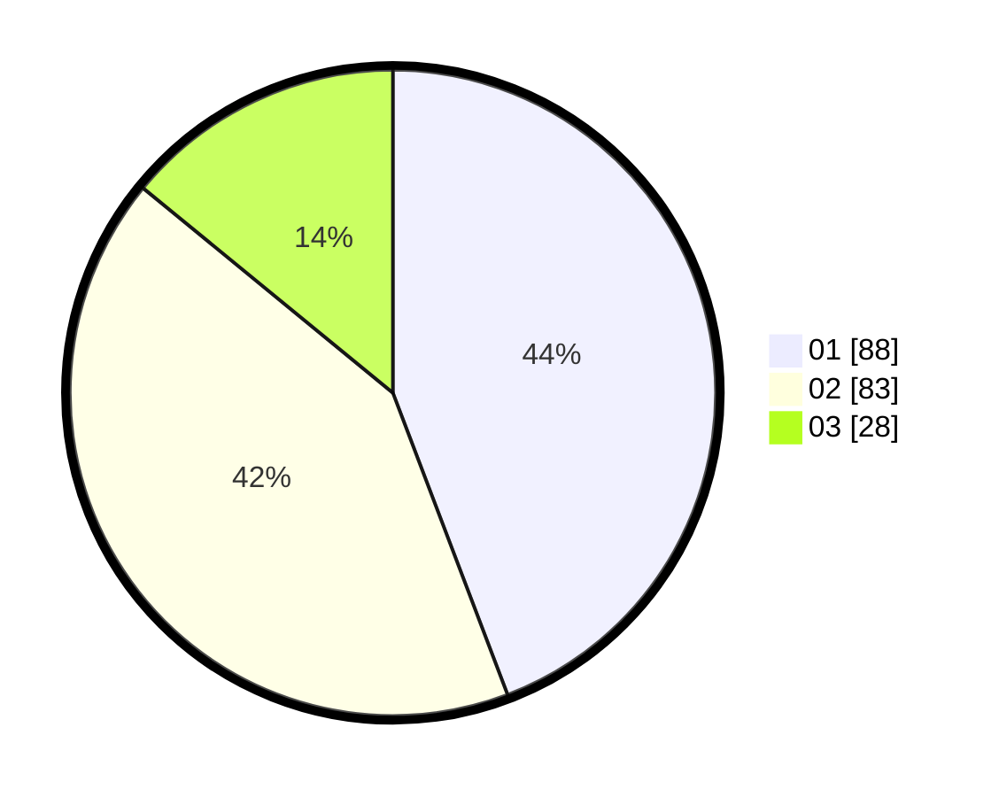

# Hasil

Hasil perolehan suara paslon dapat dilihat pada file paslon-01.txt, paslon-02.txt, dan paslon-03.txt.

Jika tidak ada, artinya data tersebut belum ada pada SIREKAP.

## Perolehan Suara

 * Paslon 01: **88**.
 * Paslon 02: **83**.
 * Paslon 03: **28**.

## Foto C Plano

https://sirekap-obj-formc.kpu.go.id/aab1/pemilu/ppwp/31/75/05/10/01/3175051001036-20240216-064059--3be180d0-630e-4d01-8263-83bd7a909ae2.jpg

https://sirekap-obj-formc.kpu.go.id/aab1/pemilu/ppwp/31/75/05/10/01/3175051001036-20240214-194002--36828b17-8cbf-4b91-8afd-c82ed3352847.jpg

https://sirekap-obj-formc.kpu.go.id/aab1/pemilu/ppwp/31/75/05/10/01/3175051001036-20240216-064100--70f89131-8135-4de7-96a2-0c87ec0e592b.jpg

## DATA PEMILIH TETAP

Jumlah pemilih dalam DPT: **253**.
 * L: **122**.
 * P: **131**.

## DATA PENGGUNA HAK PILIH

Jumlah pengguna hak pilih dalam DPT: **204**.
 * L: **94**.
 * P: **110**.

Jumlah pengguna hak pilih dalam DPTb: **2**.
 * L: **1**.
 * P: **1**.

Jumlah pengguna hak pilih dalam DPK: **0**.
 * L: **0**.
 * P: **0**.

Jumlah pengguna hak pilih: **206**.
 * L: **95**.
 * P: **111**.

## JUMLAH SUARA SAH DAN TIDAK SAH

JUMLAH SELURUH SUARA SAH: **199**.

JUMLAH SUARA TIDAK SAH: **7**.

JUMLAH SELURUH SUARA SAH DAN SUARA TIDAK SAH: **206**.
