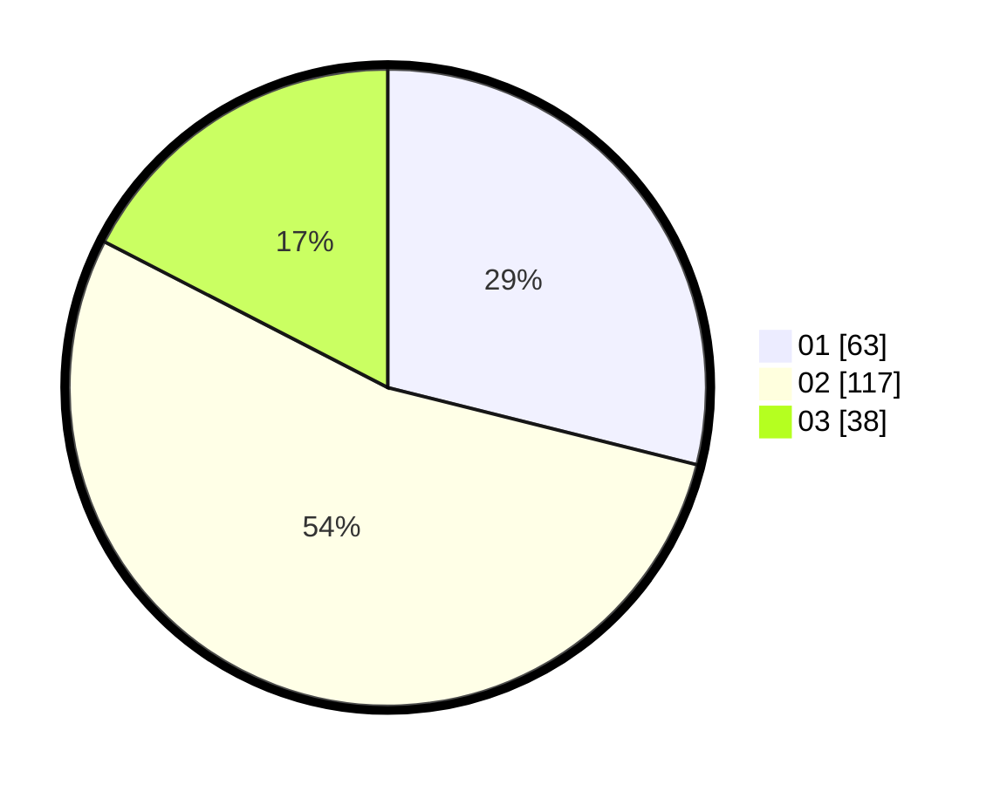

# Hasil

Hasil perolehan suara paslon dapat dilihat pada file paslon-01.txt, paslon-02.txt, dan paslon-03.txt.

Jika tidak ada, artinya data tersebut belum ada pada SIREKAP.

## Perolehan Suara

 * Paslon 01: **63**.
 * Paslon 02: **117**.
 * Paslon 03: **38**.

## Foto C Plano

https://sirekap-obj-formc.kpu.go.id/d5db/pemilu/ppwp/31/75/05/10/01/3175051001044-20240214-193932--d0dd7388-922d-42b7-9722-2190a569e29d.jpg

https://sirekap-obj-formc.kpu.go.id/d5db/pemilu/ppwp/31/75/05/10/01/3175051001044-20240214-193804--431a132b-943e-4c48-a20e-f7d3f800b092.jpg

https://sirekap-obj-formc.kpu.go.id/d5db/pemilu/ppwp/31/75/05/10/01/3175051001044-20240214-193702--96206c3f-2b22-4587-ad2c-afb81ea1f63e.jpg

## DATA PEMILIH TETAP

Jumlah pemilih dalam DPT: **288**.
 * L: **129**.
 * P: **159**.

## DATA PENGGUNA HAK PILIH

Jumlah pengguna hak pilih dalam DPT: **202**.
 * L: **89**.
 * P: **113**.

Jumlah pengguna hak pilih dalam DPTb: **8**.
 * L: **4**.
 * P: **4**.

Jumlah pengguna hak pilih dalam DPK: **11**.
 * L: **3**.
 * P: **8**.

Jumlah pengguna hak pilih: **221**.
 * L: **96**.
 * P: **125**.

## JUMLAH SUARA SAH DAN TIDAK SAH

JUMLAH SELURUH SUARA SAH: **218**.

JUMLAH SUARA TIDAK SAH: **3**.

JUMLAH SELURUH SUARA SAH DAN SUARA TIDAK SAH: **221**.
