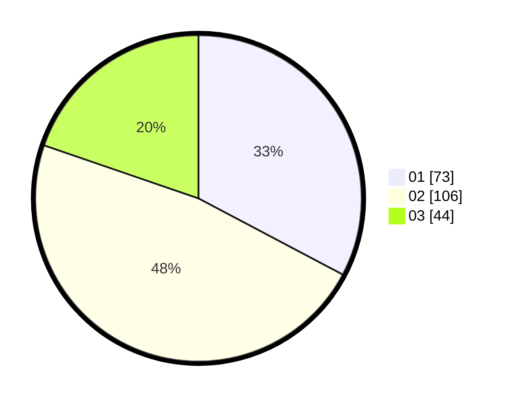

# Hasil

Hasil perolehan suara paslon dapat dilihat pada file paslon-01.txt, paslon-02.txt, dan paslon-03.txt.

Jika tidak ada, artinya data tersebut belum ada pada SIREKAP.

## Perolehan Suara

 * Paslon 01: **73**.
 * Paslon 02: **106**.
 * Paslon 03: **44**.

## Foto C Plano

https://sirekap-obj-formc.kpu.go.id/a295/pemilu/ppwp/31/75/05/10/01/3175051001045-20240214-155433--5ab6ce18-657a-43c4-8a68-14c6430d10aa.jpg

https://sirekap-obj-formc.kpu.go.id/a295/pemilu/ppwp/31/75/05/10/01/3175051001045-20240214-155641--0d0aa6d1-3aa2-416b-8bb2-2ca9138be66f.jpg

https://sirekap-obj-formc.kpu.go.id/a295/pemilu/ppwp/31/75/05/10/01/3175051001045-20240214-155813--1c6576b1-f238-45b9-b589-5739edc4c158.jpg
