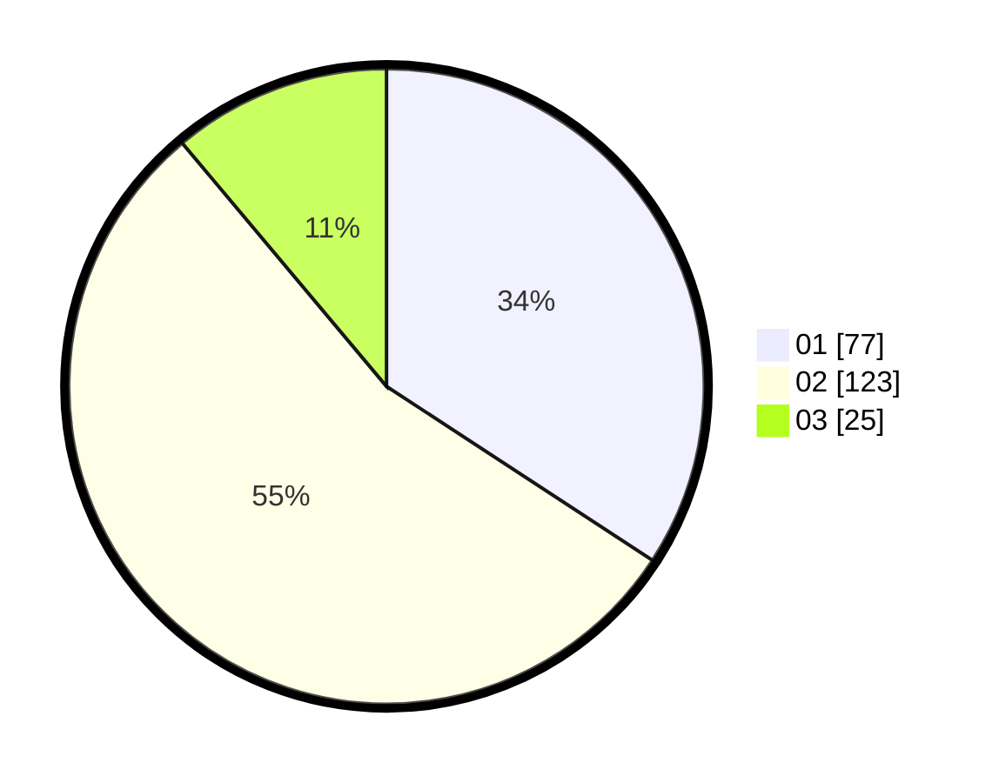

# Hasil

Hasil perolehan suara paslon dapat dilihat pada file paslon-01.txt, paslon-02.txt, dan paslon-03.txt.

Jika tidak ada, artinya data tersebut belum ada pada SIREKAP.

## Perolehan Suara

 * Paslon 01: **77**.
 * Paslon 02: **123**.
 * Paslon 03: **25**.

## Foto C Plano

https://sirekap-obj-formc.kpu.go.id/45cb/pemilu/ppwp/31/75/05/10/01/3175051001047-20240214-214513--bfce296b-2704-4684-9337-f75d8b5d4cd2.jpg

https://sirekap-obj-formc.kpu.go.id/45cb/pemilu/ppwp/31/75/05/10/01/3175051001047-20240214-214837--2d8118a8-2796-4e63-920e-ded16d364afb.jpg

https://sirekap-obj-formc.kpu.go.id/45cb/pemilu/ppwp/31/75/05/10/01/3175051001047-20240214-215113--c120e442-42aa-46d0-8ef3-4351a23c7a77.jpg
