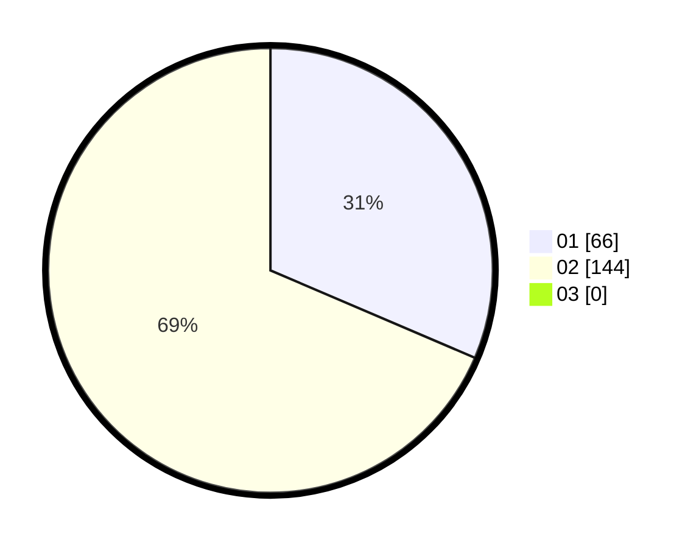

# Hasil

Hasil perolehan suara paslon dapat dilihat pada file paslon-01.txt, paslon-02.txt, dan paslon-03.txt.

Jika tidak ada, artinya data tersebut belum ada pada SIREKAP.

## Perolehan Suara

 * Paslon 01: **66**.
 * Paslon 02: **144**.
 * Paslon 03: **0**.

## Foto C Plano

https://sirekap-obj-formc.kpu.go.id/85aa/pemilu/ppwp/31/75/05/10/01/3175051001048-20240214-155142--01dc05e0-d7bb-42d6-9ec0-58700d5f4090.jpg

https://sirekap-obj-formc.kpu.go.id/85aa/pemilu/ppwp/31/75/05/10/01/3175051001048-20240214-155620--6d07a63d-cd3b-402c-ad67-b732dabff971.jpg

https://sirekap-obj-formc.kpu.go.id/85aa/pemilu/ppwp/31/75/05/10/01/3175051001048-20240214-155823--2a7853a9-226f-4894-8b99-35ef3f4829c4.jpg
