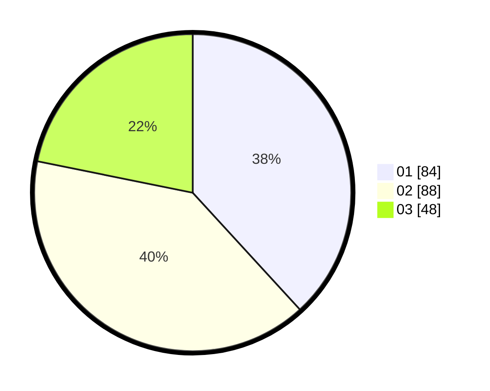

# Hasil

Hasil perolehan suara paslon dapat dilihat pada file paslon-01.txt, paslon-02.txt, dan paslon-03.txt.

Jika tidak ada, artinya data tersebut belum ada pada SIREKAP.

## Perolehan Suara

 * Paslon 01: **84**.
 * Paslon 02: **88**.
 * Paslon 03: **48**.

## Foto C Plano

https://sirekap-obj-formc.kpu.go.id/435d/pemilu/ppwp/31/75/05/10/01/3175051001053-20240215-015813--59d68865-e257-4721-8d6b-aab8664d80f5.jpg

https://sirekap-obj-formc.kpu.go.id/435d/pemilu/ppwp/31/75/05/10/01/3175051001053-20240215-015906--1ebde70f-0350-4f69-90d7-97e214da0378.jpg

https://sirekap-obj-formc.kpu.go.id/435d/pemilu/ppwp/31/75/05/10/01/3175051001053-20240215-020003--134d634f-99f2-474d-bb27-5c0fc73fc434.jpg
