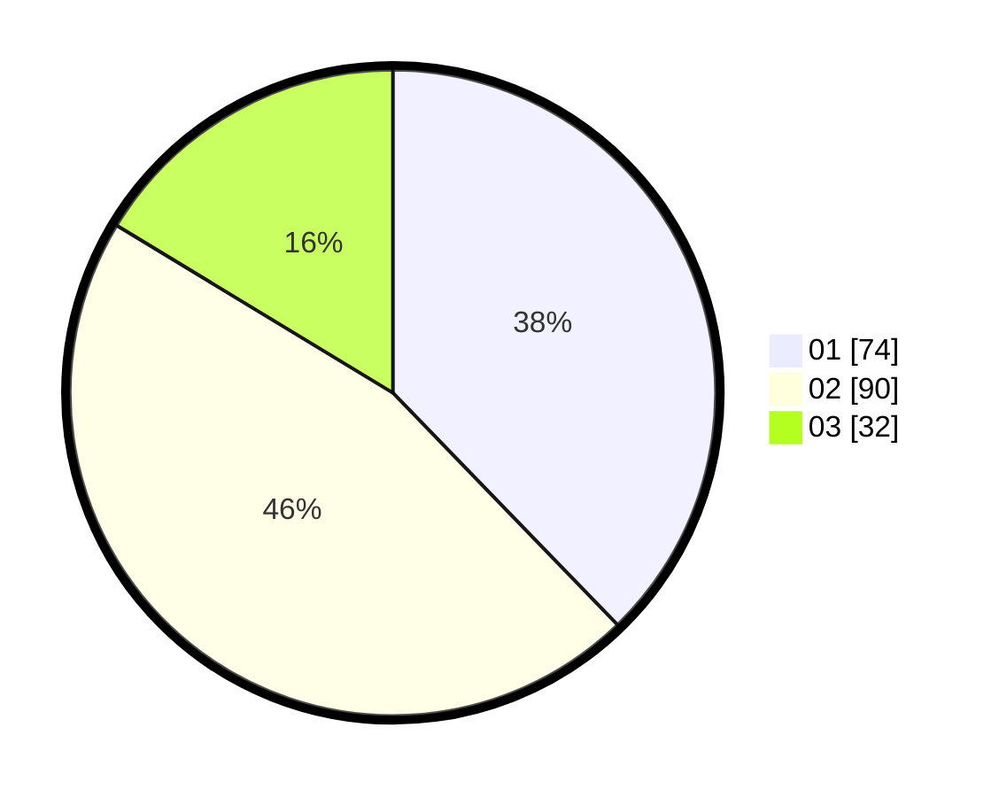

# Hasil

Hasil perolehan suara paslon dapat dilihat pada file paslon-01.txt, paslon-02.txt, dan paslon-03.txt.

Jika tidak ada, artinya data tersebut belum ada pada SIREKAP.

## Perolehan Suara

 * Paslon 01: **74**.
 * Paslon 02: **90**.
 * Paslon 03: **32**.

## Foto C Plano

https://sirekap-obj-formc.kpu.go.id/6fee/pemilu/ppwp/31/75/05/10/01/3175051001059-20240214-185756--79d19d57-8608-44c5-8309-3b6bbee15663.jpg

https://sirekap-obj-formc.kpu.go.id/6fee/pemilu/ppwp/31/75/05/10/01/3175051001059-20240214-185804--2825d06f-c4df-4133-a872-05acb27ce6ac.jpg

https://sirekap-obj-formc.kpu.go.id/6fee/pemilu/ppwp/31/75/05/10/01/3175051001059-20240214-190656--19c5edf1-caf2-4b4f-8ddb-1ee92aef345c.jpg

## DATA PEMILIH TETAP

Jumlah pemilih dalam DPT: **256**.
 * L: **126**.
 * P: **130**.

## DATA PENGGUNA HAK PILIH

Jumlah pengguna hak pilih dalam DPT: **197**.
 * L: **98**.
 * P: **99**.

Jumlah pengguna hak pilih dalam DPTb: **2**.
 * L: **1**.
 * P: **1**.

Jumlah pengguna hak pilih dalam DPK: **0**.
 * L: **0**.
 * P: **0**.

Jumlah pengguna hak pilih: **199**.
 * L: **99**.
 * P: **100**.

## JUMLAH SUARA SAH DAN TIDAK SAH

JUMLAH SELURUH SUARA SAH: **196**.

JUMLAH SUARA TIDAK SAH: **3**.

JUMLAH SELURUH SUARA SAH DAN SUARA TIDAK SAH: **199**.
