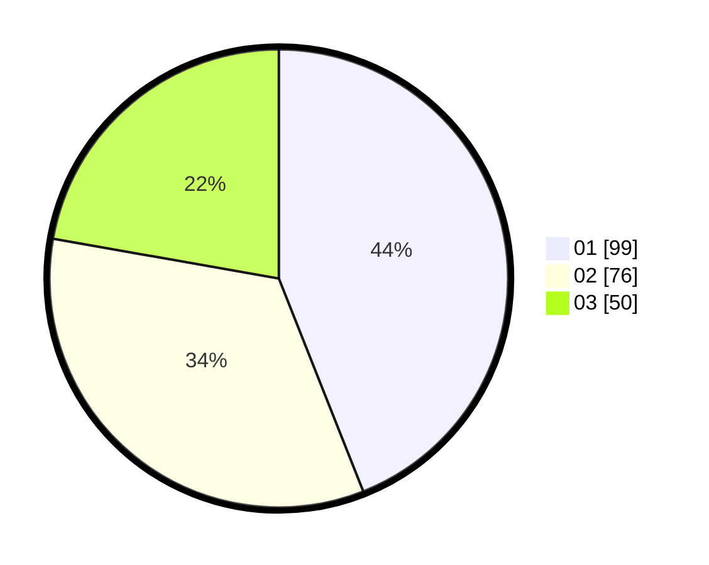

# Hasil

Hasil perolehan suara paslon dapat dilihat pada file paslon-01.txt, paslon-02.txt, dan paslon-03.txt.

Jika tidak ada, artinya data tersebut belum ada pada SIREKAP.

## Perolehan Suara

 * Paslon 01: **99**.
 * Paslon 02: **76**.
 * Paslon 03: **50**.

## Foto C Plano

https://sirekap-obj-formc.kpu.go.id/a03e/pemilu/ppwp/31/75/05/10/01/3175051001062-20240214-192456--bd1e4328-62d2-4459-a3e0-f060d3979a6f.jpg

https://sirekap-obj-formc.kpu.go.id/a03e/pemilu/ppwp/31/75/05/10/01/3175051001062-20240214-192506--07831e62-39ec-4871-8e3c-c648fc490750.jpg

https://sirekap-obj-formc.kpu.go.id/a03e/pemilu/ppwp/31/75/05/10/01/3175051001062-20240214-192512--6294dfda-b8d9-4421-a795-019b0b274acc.jpg

## DATA PEMILIH TETAP

Jumlah pemilih dalam DPT: **255**.
 * L: **119**.
 * P: **136**.

## DATA PENGGUNA HAK PILIH

Jumlah pengguna hak pilih dalam DPT: **207**.
 * L: **94**.
 * P: **113**.

Jumlah pengguna hak pilih dalam DPTb: **20**.
 * L: **10**.
 * P: **10**.

Jumlah pengguna hak pilih dalam DPK: **1**.
 * L: **0**.
 * P: **1**.

Jumlah pengguna hak pilih: **228**.
 * L: **104**.
 * P: **124**.

## JUMLAH SUARA SAH DAN TIDAK SAH

JUMLAH SELURUH SUARA SAH: **225**.

JUMLAH SUARA TIDAK SAH: **3**.

JUMLAH SELURUH SUARA SAH DAN SUARA TIDAK SAH: **228**.
