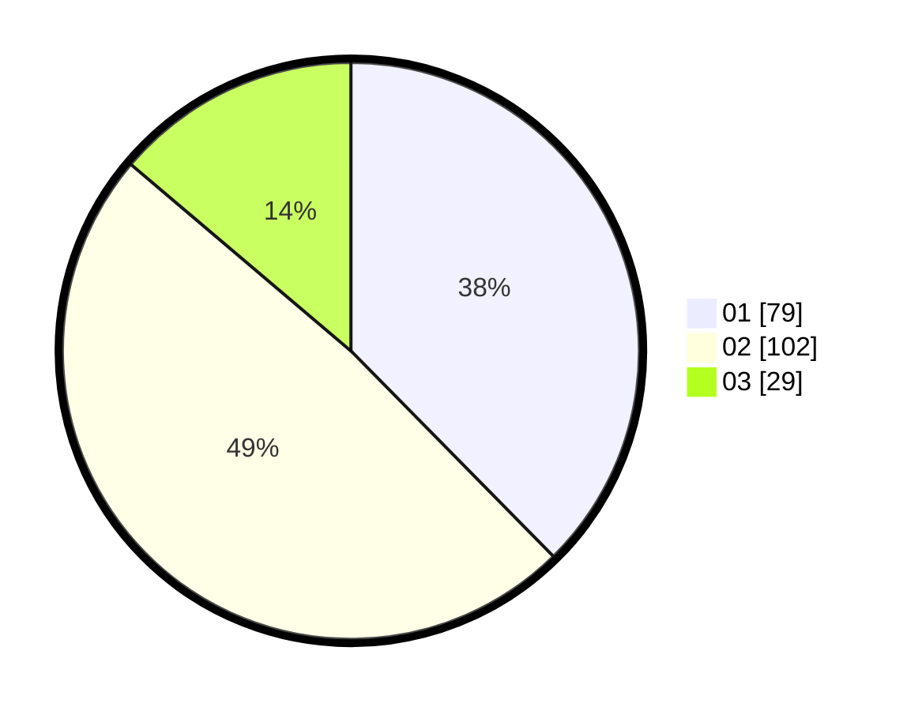

# Hasil

Hasil perolehan suara paslon dapat dilihat pada file paslon-01.txt, paslon-02.txt, dan paslon-03.txt.

Jika tidak ada, artinya data tersebut belum ada pada SIREKAP.

## Perolehan Suara

 * Paslon 01: **79**.
 * Paslon 02: **102**.
 * Paslon 03: **29**.

## Foto C Plano

https://sirekap-obj-formc.kpu.go.id/c2c3/pemilu/ppwp/31/75/05/10/01/3175051001073-20240214-193628--012c3f83-fc27-430f-a915-db888077516d.jpg

https://sirekap-obj-formc.kpu.go.id/c2c3/pemilu/ppwp/31/75/05/10/01/3175051001073-20240214-193733--865c726b-6480-4615-929c-32dbc11c5688.jpg

https://sirekap-obj-formc.kpu.go.id/c2c3/pemilu/ppwp/31/75/05/10/01/3175051001073-20240214-232843--e70a8b8e-3e08-45ab-84ee-498491c9ed62.jpg
