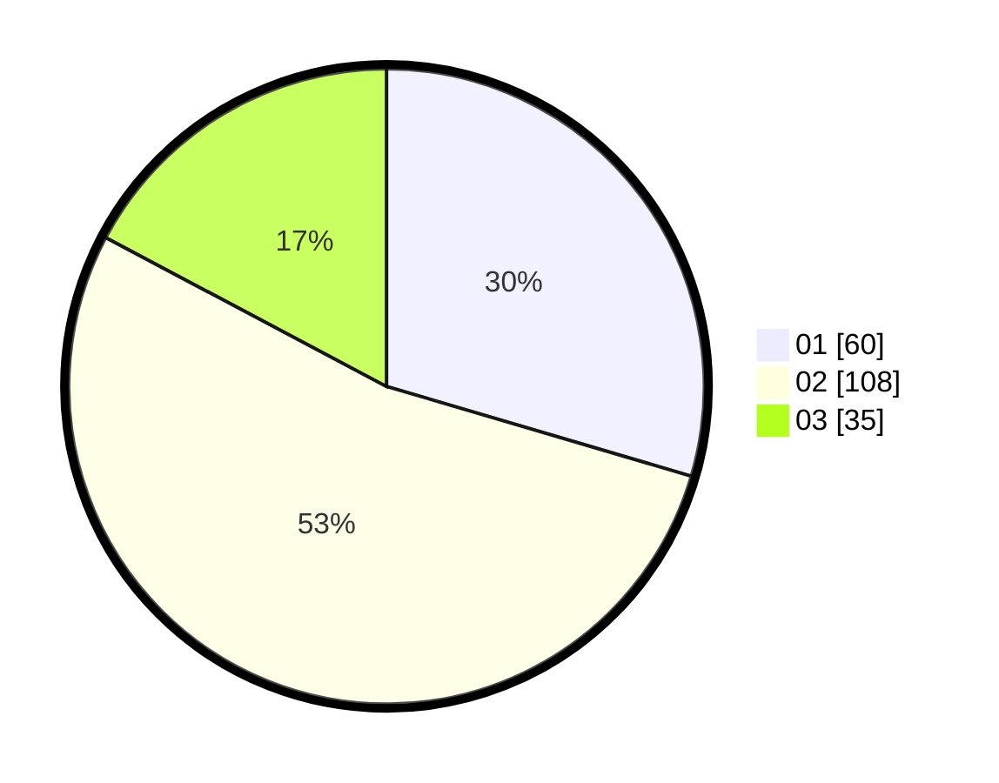

# Hasil

Hasil perolehan suara paslon dapat dilihat pada file paslon-01.txt, paslon-02.txt, dan paslon-03.txt.

Jika tidak ada, artinya data tersebut belum ada pada SIREKAP.

## Perolehan Suara

 * Paslon 01: **60**.
 * Paslon 02: **108**.
 * Paslon 03: **35**.

## Foto C Plano

https://sirekap-obj-formc.kpu.go.id/3a77/pemilu/ppwp/31/75/05/10/01/3175051001095-20240214-205836--f32aa028-c89c-44de-9a92-da5f92d426db.jpg

https://sirekap-obj-formc.kpu.go.id/3a77/pemilu/ppwp/31/75/05/10/01/3175051001095-20240214-210141--60fd9667-4f03-4b0a-bfe0-ac7062ba37d7.jpg

https://sirekap-obj-formc.kpu.go.id/3a77/pemilu/ppwp/31/75/05/10/01/3175051001095-20240214-210101--a1c53888-c03e-4834-82e2-a87ab7e396ed.jpg

## DATA PEMILIH TETAP

Jumlah pemilih dalam DPT: **257**.
 * L: **122**.
 * P: **135**.

## DATA PENGGUNA HAK PILIH

Jumlah pengguna hak pilih dalam DPT: **215**.
 * L: **102**.
 * P: **113**.

Jumlah pengguna hak pilih dalam DPTb: **1**.
 * L: **1**.
 * P: **0**.

Jumlah pengguna hak pilih dalam DPK: **0**.
 * L: **0**.
 * P: **0**.

Jumlah pengguna hak pilih: **216**.
 * L: **103**.
 * P: **113**.

## JUMLAH SUARA SAH DAN TIDAK SAH

JUMLAH SELURUH SUARA SAH: **209**.

JUMLAH SUARA TIDAK SAH: **7**.

JUMLAH SELURUH SUARA SAH DAN SUARA TIDAK SAH: **216**.
