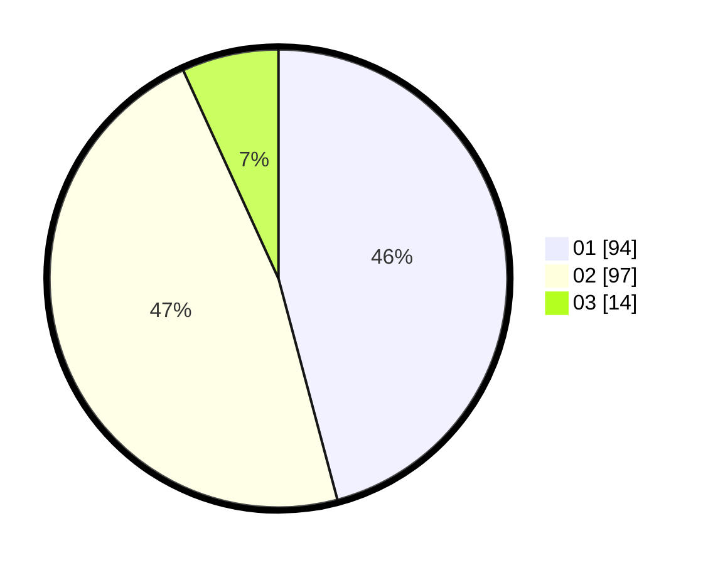

# Hasil

Hasil perolehan suara paslon dapat dilihat pada file paslon-01.txt, paslon-02.txt, dan paslon-03.txt.

Jika tidak ada, artinya data tersebut belum ada pada SIREKAP.

## Perolehan Suara

 * Paslon 01: **94**.
 * Paslon 02: **97**.
 * Paslon 03: **14**.

## Foto C Plano

https://sirekap-obj-formc.kpu.go.id/709e/pemilu/ppwp/31/75/05/10/01/3175051001096-20240214-192858--ce18b2a5-745e-4ef7-9ea8-a7aec00c19b2.jpg

https://sirekap-obj-formc.kpu.go.id/709e/pemilu/ppwp/31/75/05/10/01/3175051001096-20240214-193333--82b1f7e4-a59b-4fae-ba55-fd7c0dbf2903.jpg

https://sirekap-obj-formc.kpu.go.id/709e/pemilu/ppwp/31/75/05/10/01/3175051001096-20240214-193437--6221b26d-4104-4074-a9e0-c67bed3d1de0.jpg
