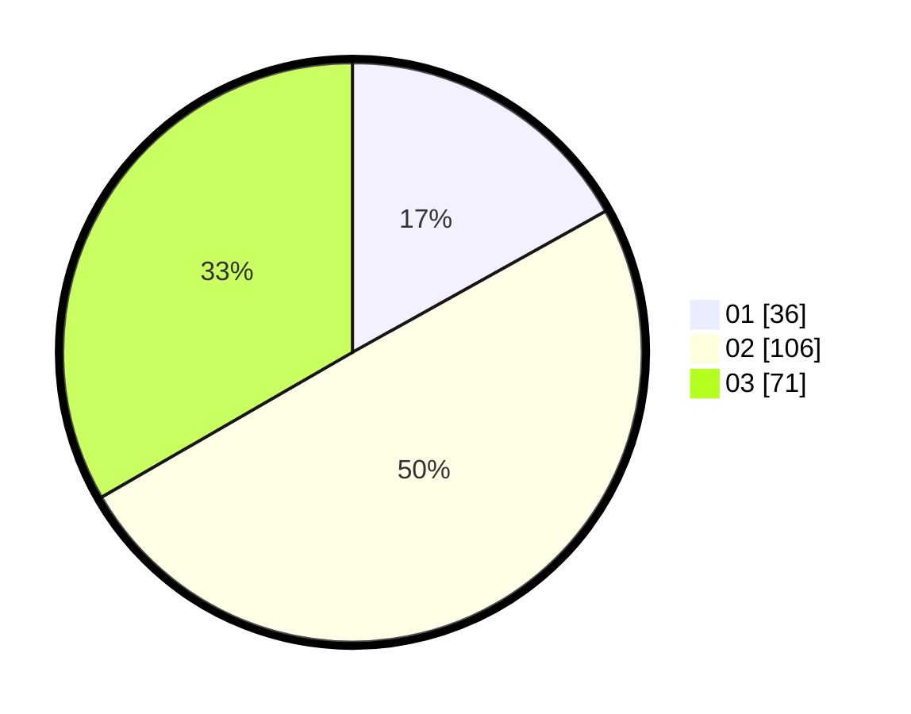

# Hasil

Hasil perolehan suara paslon dapat dilihat pada file paslon-01.txt, paslon-02.txt, dan paslon-03.txt.

Jika tidak ada, artinya data tersebut belum ada pada SIREKAP.

## Perolehan Suara

 * Paslon 01: **36**.
 * Paslon 02: **106**.
 * Paslon 03: **71**.

## Foto C Plano

https://sirekap-obj-formc.kpu.go.id/010b/pemilu/ppwp/31/75/05/10/01/3175051001101-20240214-191459--5494605f-6678-4842-9d4f-bff1074fee4c.jpg

https://sirekap-obj-formc.kpu.go.id/010b/pemilu/ppwp/31/75/05/10/01/3175051001101-20240215-021909--96e1cf44-d873-413d-9a35-424d304450a7.jpg

https://sirekap-obj-formc.kpu.go.id/010b/pemilu/ppwp/31/75/05/10/01/3175051001101-20240214-191816--767ab293-9bb6-4ba9-9967-a7a98047a1d1.jpg

## DATA PEMILIH TETAP

Jumlah pemilih dalam DPT: **263**.
 * L: **136**.
 * P: **127**.

## DATA PENGGUNA HAK PILIH

Jumlah pengguna hak pilih dalam DPT: **206**.
 * L: **101**.
 * P: **105**.

Jumlah pengguna hak pilih dalam DPTb: **6**.
 * L: **4**.
 * P: **2**.

Jumlah pengguna hak pilih dalam DPK: **1**.
 * L: **0**.
 * P: **1**.

Jumlah pengguna hak pilih: **213**.
 * L: **105**.
 * P: **108**.

## JUMLAH SUARA SAH DAN TIDAK SAH

JUMLAH SELURUH SUARA SAH: **213**.

JUMLAH SUARA TIDAK SAH: **0**.

JUMLAH SELURUH SUARA SAH DAN SUARA TIDAK SAH: **213**.
