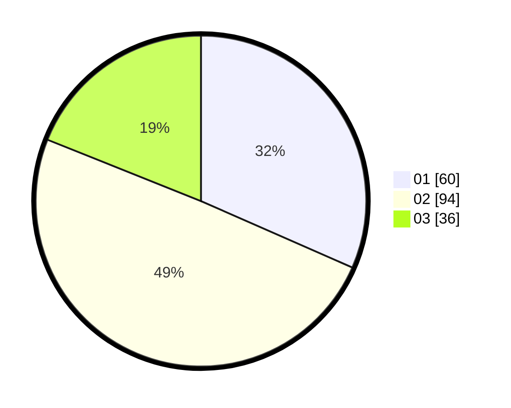

# Hasil

Hasil perolehan suara paslon dapat dilihat pada file paslon-01.txt, paslon-02.txt, dan paslon-03.txt.

Jika tidak ada, artinya data tersebut belum ada pada SIREKAP.

## Perolehan Suara

 * Paslon 01: **60**.
 * Paslon 02: **94**.
 * Paslon 03: **36**.

## Foto C Plano

https://sirekap-obj-formc.kpu.go.id/9dc8/pemilu/ppwp/31/75/05/10/01/3175051001104-20240214-194855--ce223529-0b23-4303-b6ab-6eed294d8985.jpg

https://sirekap-obj-formc.kpu.go.id/9dc8/pemilu/ppwp/31/75/05/10/01/3175051001104-20240214-202009--690088f2-252d-4139-954c-f499453650d2.jpg

https://sirekap-obj-formc.kpu.go.id/9dc8/pemilu/ppwp/31/75/05/10/01/3175051001104-20240214-202355--67143d8f-a6b5-4f70-beb2-119eab4ee246.jpg
