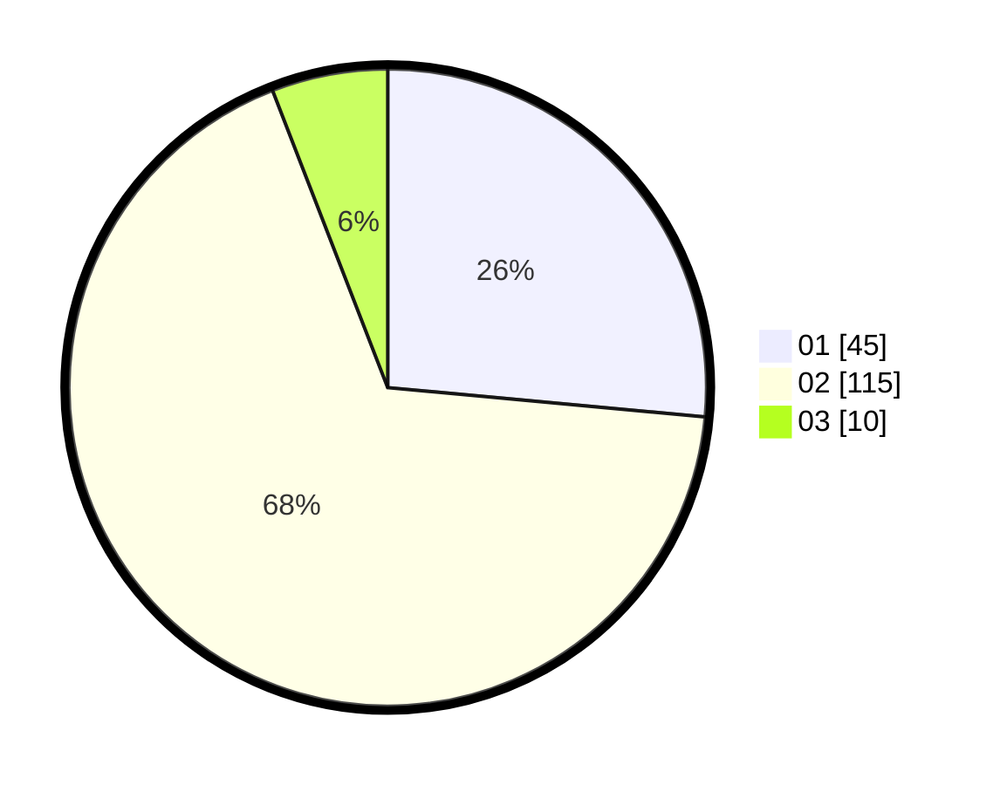

# Hasil

Hasil perolehan suara paslon dapat dilihat pada file paslon-01.txt, paslon-02.txt, dan paslon-03.txt.

Jika tidak ada, artinya data tersebut belum ada pada SIREKAP.

## Perolehan Suara

 * Paslon 01: **45**.
 * Paslon 02: **115**.
 * Paslon 03: **10**.

## Foto C Plano

https://sirekap-obj-formc.kpu.go.id/1bc5/pemilu/ppwp/31/75/05/10/01/3175051001105-20240214-213551--c234d31c-9fc1-4361-8d14-8e32c75da0b7.jpg

https://sirekap-obj-formc.kpu.go.id/1bc5/pemilu/ppwp/31/75/05/10/01/3175051001105-20240214-213623--f62d962b-bf0b-4915-b371-f393b957b15e.jpg
