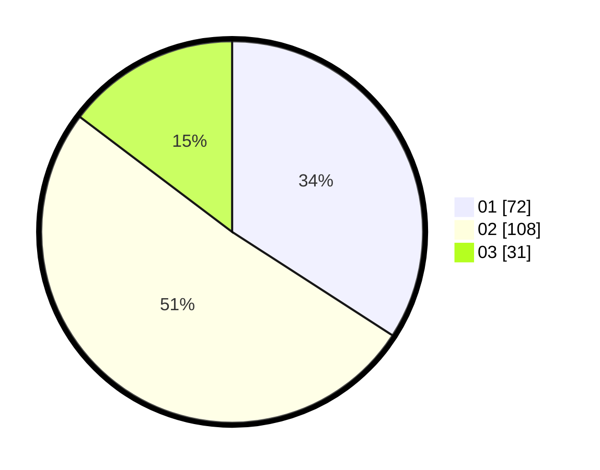

# Hasil

Hasil perolehan suara paslon dapat dilihat pada file paslon-01.txt, paslon-02.txt, dan paslon-03.txt.

Jika tidak ada, artinya data tersebut belum ada pada SIREKAP.

## Perolehan Suara

 * Paslon 01: **72**.
 * Paslon 02: **108**.
 * Paslon 03: **31**.

## Foto C Plano

https://sirekap-obj-formc.kpu.go.id/8581/pemilu/ppwp/31/75/05/10/01/3175051001113-20240215-222843--261cad5e-d4b4-454f-9400-440081c5b857.jpg

https://sirekap-obj-formc.kpu.go.id/8581/pemilu/ppwp/31/75/05/10/01/3175051001113-20240215-222539--ca5af32c-fa82-4154-9367-e78edb8ebe5b.jpg
