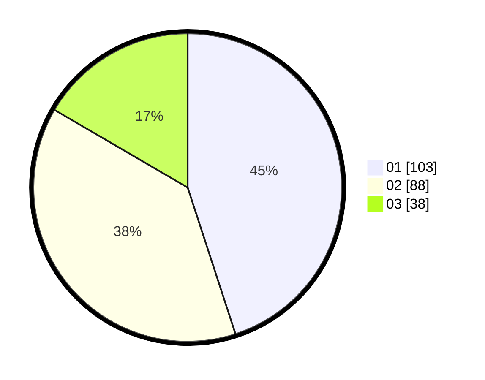

# Hasil

Hasil perolehan suara paslon dapat dilihat pada file paslon-01.txt, paslon-02.txt, dan paslon-03.txt.

Jika tidak ada, artinya data tersebut belum ada pada SIREKAP.

## Perolehan Suara

 * Paslon 01: **103**.
 * Paslon 02: **88**.
 * Paslon 03: **38**.

## Foto C Plano

https://sirekap-obj-formc.kpu.go.id/8e82/pemilu/ppwp/31/75/05/10/01/3175051001114-20240214-184632--61d4ac2b-6a13-4840-980d-b228c66a9032.jpg

https://sirekap-obj-formc.kpu.go.id/8e82/pemilu/ppwp/31/75/05/10/01/3175051001114-20240214-155106--b05db9cf-c393-431c-8e1c-c2d07c5ef8d0.jpg

https://sirekap-obj-formc.kpu.go.id/8e82/pemilu/ppwp/31/75/05/10/01/3175051001114-20240214-155119--140a8fcc-ea26-40c6-b8a0-4cb4efb577bc.jpg

## DATA PEMILIH TETAP

Jumlah pemilih dalam DPT: **267**.
 * L: **126**.
 * P: **141**.

## DATA PENGGUNA HAK PILIH

Jumlah pengguna hak pilih dalam DPT: **216**.
 * L: **93**.
 * P: **123**.

Jumlah pengguna hak pilih dalam DPTb: **12**.
 * L: **5**.
 * P: **7**.

Jumlah pengguna hak pilih dalam DPK: **4**.
 * L: **2**.
 * P: **2**.

Jumlah pengguna hak pilih: **232**.
 * L: **100**.
 * P: **132**.

## JUMLAH SUARA SAH DAN TIDAK SAH

JUMLAH SELURUH SUARA SAH: **229**.

JUMLAH SUARA TIDAK SAH: **3**.

JUMLAH SELURUH SUARA SAH DAN SUARA TIDAK SAH: **232**.
