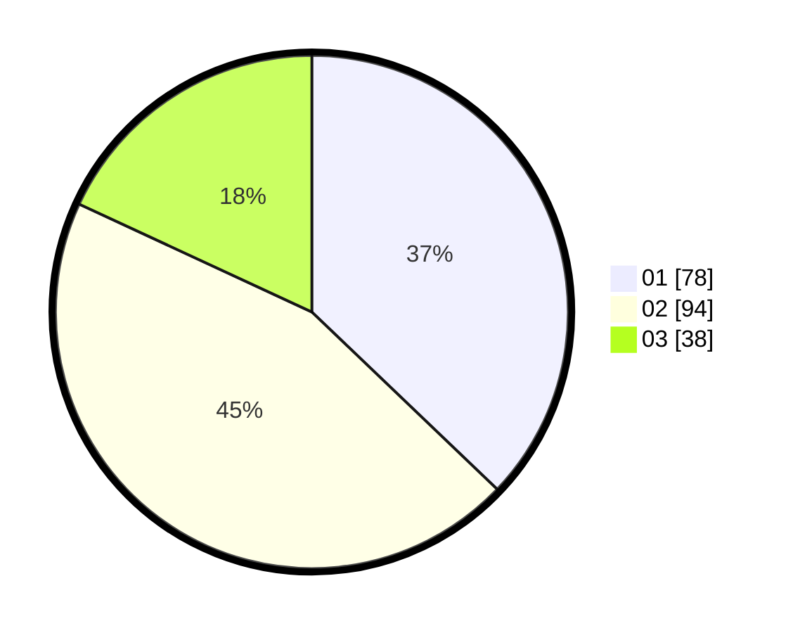

# Hasil

Hasil perolehan suara paslon dapat dilihat pada file paslon-01.txt, paslon-02.txt, dan paslon-03.txt.

Jika tidak ada, artinya data tersebut belum ada pada SIREKAP.

## Perolehan Suara

 * Paslon 01: **78**.
 * Paslon 02: **94**.
 * Paslon 03: **38**.

## Foto C Plano

https://sirekap-obj-formc.kpu.go.id/5c79/pemilu/ppwp/31/75/05/10/01/3175051001121-20240214-212808--8bfaf58b-16b7-46c1-8178-0fa184af1414.jpg

https://sirekap-obj-formc.kpu.go.id/5c79/pemilu/ppwp/31/75/05/10/01/3175051001121-20240214-212957--c2beb4f9-9330-4459-b866-051ffa8ddd9e.jpg

https://sirekap-obj-formc.kpu.go.id/5c79/pemilu/ppwp/31/75/05/10/01/3175051001121-20240214-212727--0854580f-813d-42a7-a5b4-6b95e5a7dc7a.jpg
