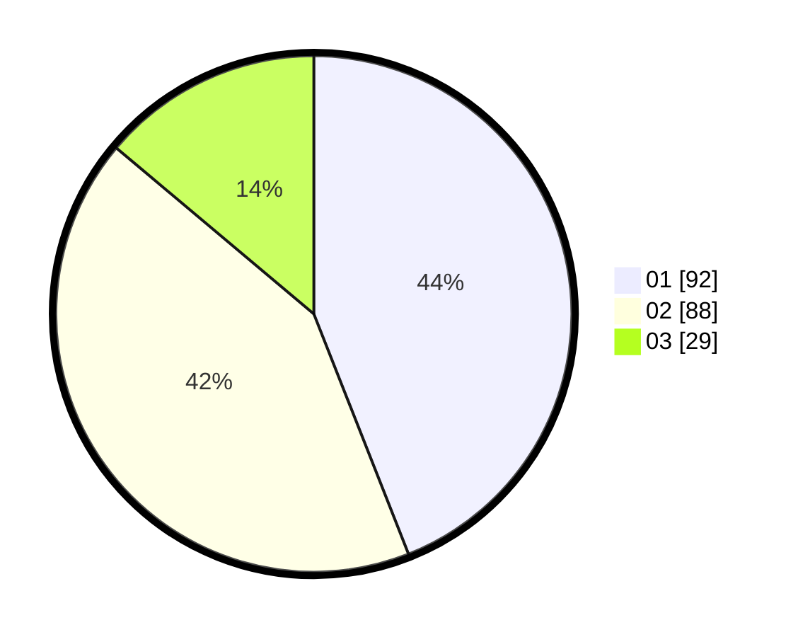

# Hasil

Hasil perolehan suara paslon dapat dilihat pada file paslon-01.txt, paslon-02.txt, dan paslon-03.txt.

Jika tidak ada, artinya data tersebut belum ada pada SIREKAP.

## Perolehan Suara

 * Paslon 01: **92**.
 * Paslon 02: **88**.
 * Paslon 03: **29**.

## Foto C Plano

https://sirekap-obj-formc.kpu.go.id/bdb4/pemilu/ppwp/31/75/05/10/01/3175051001122-20240214-205857--ce5d8b04-329c-43c7-9fe5-e7a2e0f532e5.jpg

https://sirekap-obj-formc.kpu.go.id/bdb4/pemilu/ppwp/31/75/05/10/01/3175051001122-20240214-210144--6828cbc6-5bf2-4198-b796-f7535b5399b1.jpg

https://sirekap-obj-formc.kpu.go.id/bdb4/pemilu/ppwp/31/75/05/10/01/3175051001122-20240214-155207--581201fc-d289-4405-8108-d598d2c86710.jpg
