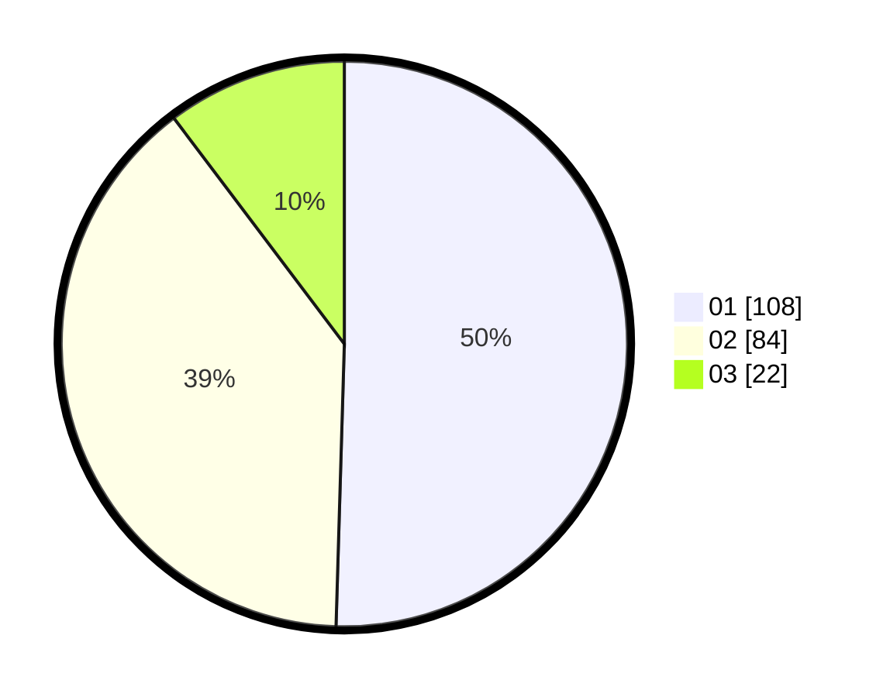

# Hasil

Hasil perolehan suara paslon dapat dilihat pada file paslon-01.txt, paslon-02.txt, dan paslon-03.txt.

Jika tidak ada, artinya data tersebut belum ada pada SIREKAP.

## Perolehan Suara

 * Paslon 01: **108**.
 * Paslon 02: **84**.
 * Paslon 03: **22**.

## Foto C Plano

https://sirekap-obj-formc.kpu.go.id/6c8d/pemilu/ppwp/31/75/05/10/02/3175051002003-20240214-230244--8a2779ac-7d41-4f4e-a7d9-bfb7a5107e3f.jpg

https://sirekap-obj-formc.kpu.go.id/6c8d/pemilu/ppwp/31/75/05/10/02/3175051002003-20240214-230402--0f099274-e86a-4d82-8b20-c40573cdb397.jpg

https://sirekap-obj-formc.kpu.go.id/6c8d/pemilu/ppwp/31/75/05/10/02/3175051002003-20240214-231045--4b1196f9-cac3-497e-935e-f6d255b89154.jpg
