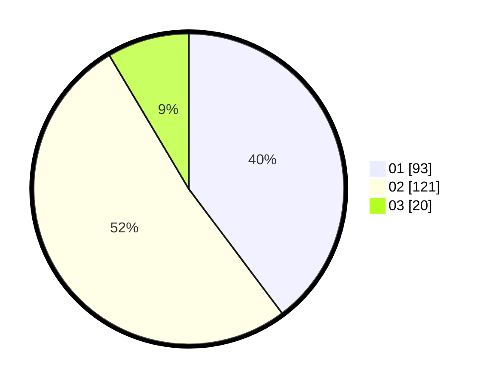

# Hasil

Hasil perolehan suara paslon dapat dilihat pada file paslon-01.txt, paslon-02.txt, dan paslon-03.txt.

Jika tidak ada, artinya data tersebut belum ada pada SIREKAP.

## Perolehan Suara

 * Paslon 01: **93**.
 * Paslon 02: **121**.
 * Paslon 03: **20**.

## Foto C Plano

https://sirekap-obj-formc.kpu.go.id/6cae/pemilu/ppwp/31/75/05/10/02/3175051002006-20240215-140618--ff43c201-6159-4936-869a-22453be07bdb.jpg

https://sirekap-obj-formc.kpu.go.id/6cae/pemilu/ppwp/31/75/05/10/02/3175051002006-20240215-140639--722d89bc-2e38-4b04-8f90-b7fc63f7aab9.jpg

https://sirekap-obj-formc.kpu.go.id/6cae/pemilu/ppwp/31/75/05/10/02/3175051002006-20240215-140629--d14328c9-85e6-43ab-a932-b41281652316.jpg

## DATA PEMILIH TETAP

Jumlah pemilih dalam DPT: **270**.
 * L: **131**.
 * P: **139**.

## DATA PENGGUNA HAK PILIH

Jumlah pengguna hak pilih dalam DPT: **231**.
 * L: **111**.
 * P: **120**.

Jumlah pengguna hak pilih dalam DPTb: **1**.
 * L: **1**.
 * P: **0**.

Jumlah pengguna hak pilih dalam DPK: **4**.
 * L: **3**.
 * P: **1**.

Jumlah pengguna hak pilih: **236**.
 * L: **115**.
 * P: **121**.

## JUMLAH SUARA SAH DAN TIDAK SAH

JUMLAH SELURUH SUARA SAH: **234**.

JUMLAH SUARA TIDAK SAH: **2**.

JUMLAH SELURUH SUARA SAH DAN SUARA TIDAK SAH: **236**.
