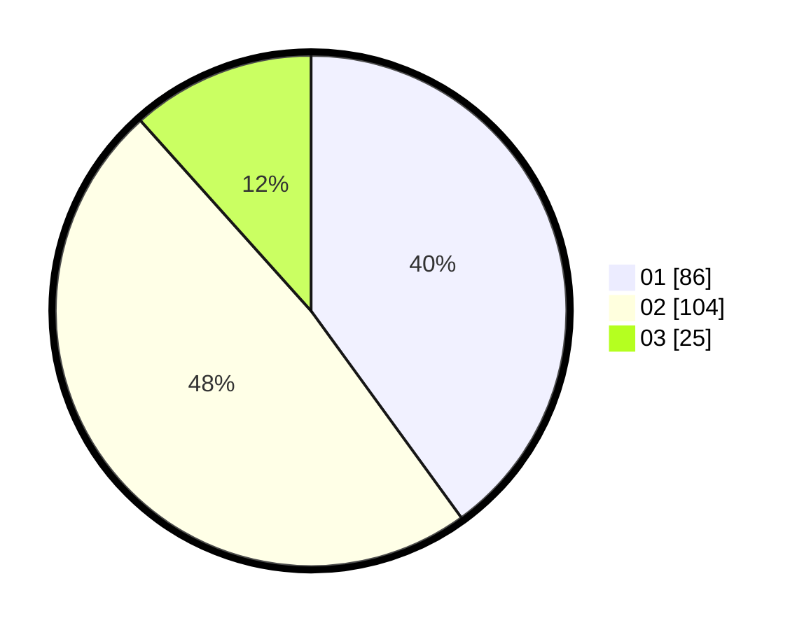

# Hasil

Hasil perolehan suara paslon dapat dilihat pada file paslon-01.txt, paslon-02.txt, dan paslon-03.txt.

Jika tidak ada, artinya data tersebut belum ada pada SIREKAP.

## Perolehan Suara

 * Paslon 01: **86**.
 * Paslon 02: **104**.
 * Paslon 03: **25**.

## Foto C Plano

https://sirekap-obj-formc.kpu.go.id/566f/pemilu/ppwp/31/75/05/10/02/3175051002009-20240214-191626--98eb4618-3fef-4daa-a0e9-0df530d18518.jpg

https://sirekap-obj-formc.kpu.go.id/566f/pemilu/ppwp/31/75/05/10/02/3175051002009-20240215-023449--c84e17e5-e252-4f63-9040-4bebe6bb74f5.jpg

https://sirekap-obj-formc.kpu.go.id/566f/pemilu/ppwp/31/75/05/10/02/3175051002009-20240215-023540--f62402fe-ec6c-45dc-b9fb-38912f3ec80d.jpg

## DATA PEMILIH TETAP

Jumlah pemilih dalam DPT: **220**.
 * L: **111**.
 * P: **109**.

## DATA PENGGUNA HAK PILIH

Jumlah pengguna hak pilih dalam DPT: **219**.
 * L: **110**.
 * P: **109**.

Jumlah pengguna hak pilih dalam DPTb: **0**.
 * L: **0**.
 * P: **0**.

Jumlah pengguna hak pilih dalam DPK: **1**.
 * L: **1**.
 * P: **0**.

Jumlah pengguna hak pilih: **220**.
 * L: **111**.
 * P: **109**.

## JUMLAH SUARA SAH DAN TIDAK SAH

JUMLAH SELURUH SUARA SAH: **215**.

JUMLAH SUARA TIDAK SAH: **5**.

JUMLAH SELURUH SUARA SAH DAN SUARA TIDAK SAH: **220**.
