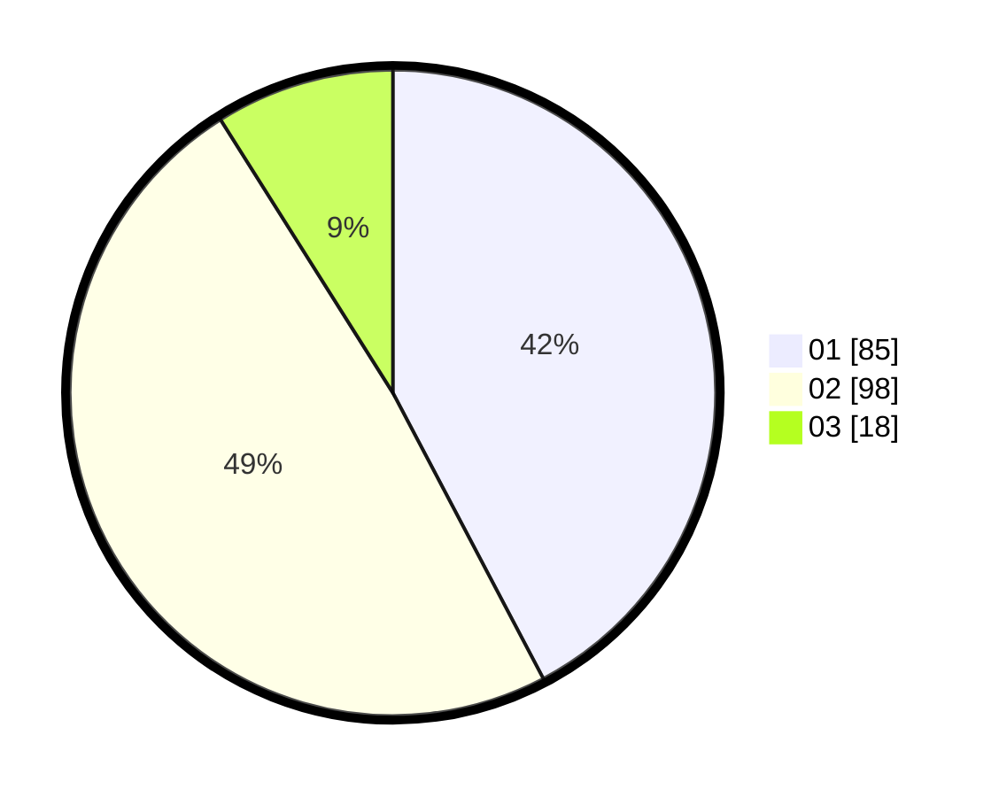

# Hasil

Hasil perolehan suara paslon dapat dilihat pada file paslon-01.txt, paslon-02.txt, dan paslon-03.txt.

Jika tidak ada, artinya data tersebut belum ada pada SIREKAP.

## Perolehan Suara

 * Paslon 01: **85**.
 * Paslon 02: **98**.
 * Paslon 03: **18**.

## Foto C Plano

https://sirekap-obj-formc.kpu.go.id/ea24/pemilu/ppwp/31/75/05/10/02/3175051002010-20240215-030136--3c1bcd2b-d607-4c0b-a484-2e1a6efa0d46.jpg

https://sirekap-obj-formc.kpu.go.id/ea24/pemilu/ppwp/31/75/05/10/02/3175051002010-20240215-030157--5ef4db72-7b45-4d28-94cc-f71eddce3cbb.jpg

https://sirekap-obj-formc.kpu.go.id/ea24/pemilu/ppwp/31/75/05/10/02/3175051002010-20240215-030147--dc1d6262-3dc0-45cd-a5e8-a4b482e018d8.jpg

## DATA PEMILIH TETAP

Jumlah pemilih dalam DPT: **240**.
 * L: **110**.
 * P: **130**.

## DATA PENGGUNA HAK PILIH

Jumlah pengguna hak pilih dalam DPT: **200**.
 * L: **94**.
 * P: **106**.

Jumlah pengguna hak pilih dalam DPTb: **2**.
 * L: **1**.
 * P: **1**.

Jumlah pengguna hak pilih dalam DPK: **1**.
 * L: **1**.
 * P: **0**.

Jumlah pengguna hak pilih: **203**.
 * L: **96**.
 * P: **107**.

## JUMLAH SUARA SAH DAN TIDAK SAH

JUMLAH SELURUH SUARA SAH: **201**.

JUMLAH SUARA TIDAK SAH: **2**.

JUMLAH SELURUH SUARA SAH DAN SUARA TIDAK SAH: **203**.
