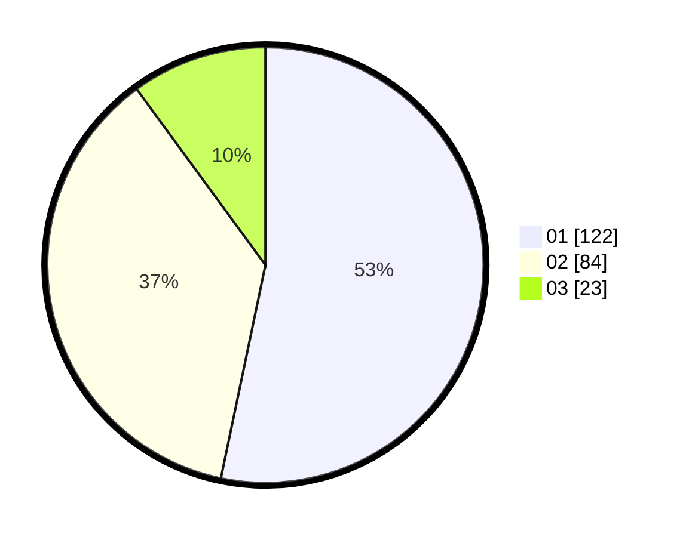

# Hasil

Hasil perolehan suara paslon dapat dilihat pada file paslon-01.txt, paslon-02.txt, dan paslon-03.txt.

Jika tidak ada, artinya data tersebut belum ada pada SIREKAP.

## Perolehan Suara

 * Paslon 01: **122**.
 * Paslon 02: **84**.
 * Paslon 03: **23**.

## Foto C Plano

https://sirekap-obj-formc.kpu.go.id/c69d/pemilu/ppwp/31/75/05/10/02/3175051002014-20240214-155048--ae8b9c5c-e7ff-4231-9e34-14c2311ae338.jpg

https://sirekap-obj-formc.kpu.go.id/c69d/pemilu/ppwp/31/75/05/10/02/3175051002014-20240214-155829--44170548-6421-4542-b3f9-11af1a730290.jpg

https://sirekap-obj-formc.kpu.go.id/c69d/pemilu/ppwp/31/75/05/10/02/3175051002014-20240214-155533--d224b563-cc58-4421-a180-48217b628540.jpg

## DATA PEMILIH TETAP

Jumlah pemilih dalam DPT: **260**.
 * L: **132**.
 * P: **128**.

## DATA PENGGUNA HAK PILIH

Jumlah pengguna hak pilih dalam DPT: **226**.
 * L: **112**.
 * P: **114**.

Jumlah pengguna hak pilih dalam DPTb: **5**.
 * L: **3**.
 * P: **2**.

Jumlah pengguna hak pilih dalam DPK: **0**.
 * L: **0**.
 * P: **0**.

Jumlah pengguna hak pilih: **231**.
 * L: **115**.
 * P: **116**.

## JUMLAH SUARA SAH DAN TIDAK SAH

JUMLAH SELURUH SUARA SAH: **229**.

JUMLAH SUARA TIDAK SAH: **2**.

JUMLAH SELURUH SUARA SAH DAN SUARA TIDAK SAH: **231**.
