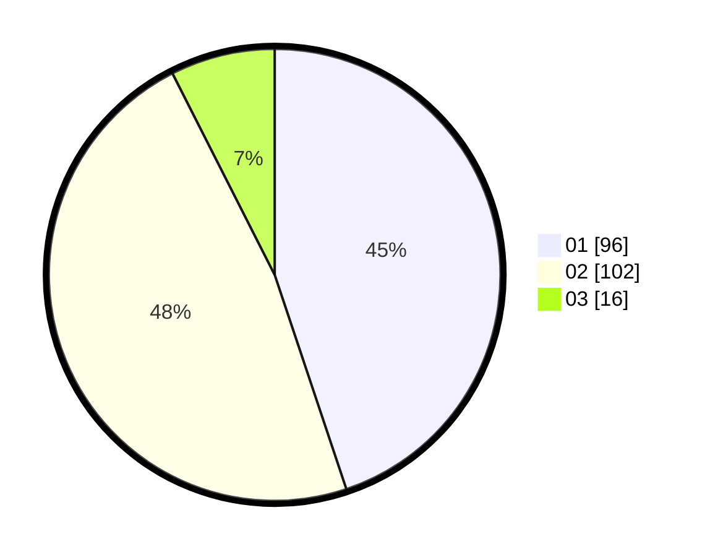

# Hasil

Hasil perolehan suara paslon dapat dilihat pada file paslon-01.txt, paslon-02.txt, dan paslon-03.txt.

Jika tidak ada, artinya data tersebut belum ada pada SIREKAP.

## Perolehan Suara

 * Paslon 01: **96**.
 * Paslon 02: **102**.
 * Paslon 03: **16**.

## Foto C Plano

https://sirekap-obj-formc.kpu.go.id/89fe/pemilu/ppwp/31/75/05/10/02/3175051002015-20240214-234007--901189f6-0cb0-4ae0-a297-dbfc1f0bab45.jpg

https://sirekap-obj-formc.kpu.go.id/89fe/pemilu/ppwp/31/75/05/10/02/3175051002015-20240214-234442--1fce46cf-bc98-4053-b02e-2600f21f03d1.jpg

https://sirekap-obj-formc.kpu.go.id/89fe/pemilu/ppwp/31/75/05/10/02/3175051002015-20240214-234333--32e58b17-e83c-4269-a502-42d81960f3aa.jpg
