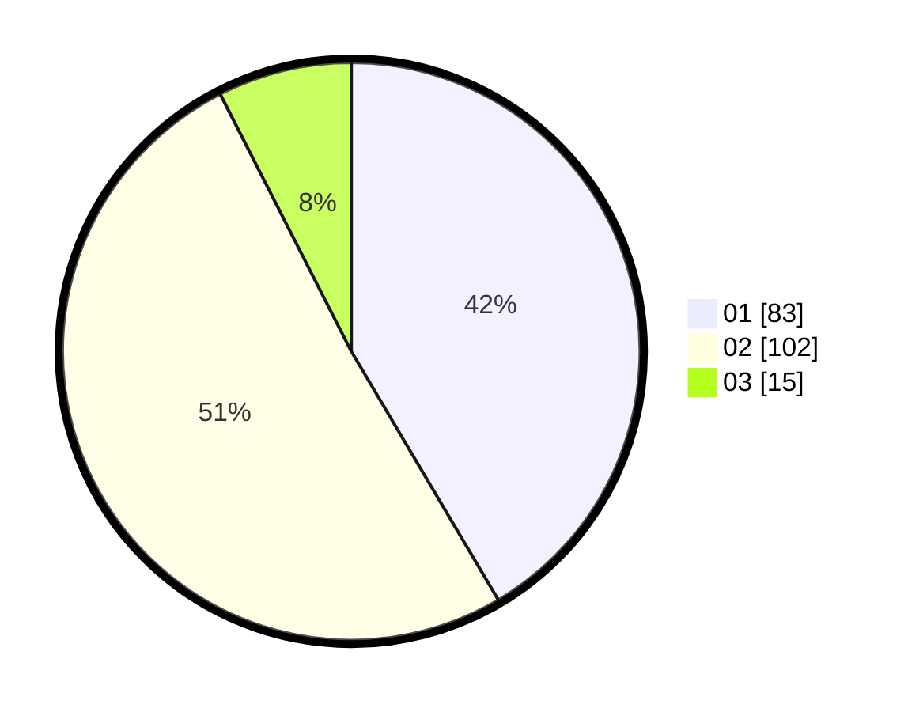

# Hasil

Hasil perolehan suara paslon dapat dilihat pada file paslon-01.txt, paslon-02.txt, dan paslon-03.txt.

Jika tidak ada, artinya data tersebut belum ada pada SIREKAP.

## Perolehan Suara

 * Paslon 01: **83**.
 * Paslon 02: **102**.
 * Paslon 03: **15**.

## Foto C Plano

https://sirekap-obj-formc.kpu.go.id/b6cc/pemilu/ppwp/31/75/05/10/02/3175051002029-20240215-010552--529f33bf-a723-4d37-87dc-13379483ac54.jpg

https://sirekap-obj-formc.kpu.go.id/b6cc/pemilu/ppwp/31/75/05/10/02/3175051002029-20240215-010654--eb8198e5-9593-481f-889b-fdcea0d06ce1.jpg

https://sirekap-obj-formc.kpu.go.id/b6cc/pemilu/ppwp/31/75/05/10/02/3175051002029-20240215-010736--22b47114-df10-484c-a3ed-420b02f2d2ae.jpg

## DATA PEMILIH TETAP

Jumlah pemilih dalam DPT: **255**.
 * L: **125**.
 * P: **130**.

## DATA PENGGUNA HAK PILIH

Jumlah pengguna hak pilih dalam DPT: **207**.
 * L: **96**.
 * P: **111**.

Jumlah pengguna hak pilih dalam DPTb: **0**.
 * L: **0**.
 * P: **0**.

Jumlah pengguna hak pilih dalam DPK: **0**.
 * L: **0**.
 * P: **0**.

Jumlah pengguna hak pilih: **207**.
 * L: **96**.
 * P: **111**.

## JUMLAH SUARA SAH DAN TIDAK SAH

JUMLAH SELURUH SUARA SAH: **200**.

JUMLAH SUARA TIDAK SAH: **7**.

JUMLAH SELURUH SUARA SAH DAN SUARA TIDAK SAH: **207**.
