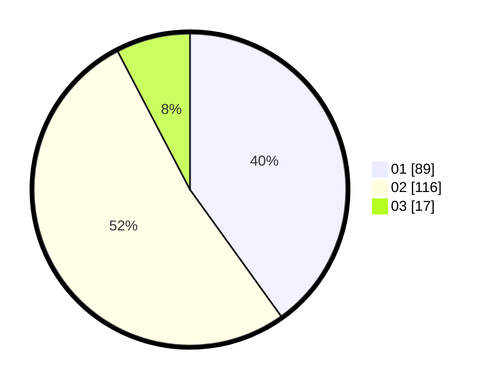

# Hasil

Hasil perolehan suara paslon dapat dilihat pada file paslon-01.txt, paslon-02.txt, dan paslon-03.txt.

Jika tidak ada, artinya data tersebut belum ada pada SIREKAP.

## Perolehan Suara

 * Paslon 01: **89**.
 * Paslon 02: **116**.
 * Paslon 03: **17**.

## Foto C Plano

https://sirekap-obj-formc.kpu.go.id/cff7/pemilu/ppwp/31/75/05/10/02/3175051002035-20240214-185542--dde5a3d3-2003-43e8-af6e-236057e54121.jpg

https://sirekap-obj-formc.kpu.go.id/cff7/pemilu/ppwp/31/75/05/10/02/3175051002035-20240214-185259--9df88b65-a2d1-4817-8999-7e90976f4141.jpg

https://sirekap-obj-formc.kpu.go.id/cff7/pemilu/ppwp/31/75/05/10/02/3175051002035-20240214-185909--c878fcda-6da3-4e60-9572-dde4cf27d03e.jpg

## DATA PEMILIH TETAP

Jumlah pemilih dalam DPT: **264**.
 * L: **134**.
 * P: **130**.

## DATA PENGGUNA HAK PILIH

Jumlah pengguna hak pilih dalam DPT: **221**.
 * L: **110**.
 * P: **111**.

Jumlah pengguna hak pilih dalam DPTb: **1**.
 * L: **0**.
 * P: **1**.

Jumlah pengguna hak pilih dalam DPK: **1**.
 * L: **1**.
 * P: **0**.

Jumlah pengguna hak pilih: **223**.
 * L: **111**.
 * P: **112**.

## JUMLAH SUARA SAH DAN TIDAK SAH

JUMLAH SELURUH SUARA SAH: **222**.

JUMLAH SUARA TIDAK SAH: **1**.

JUMLAH SELURUH SUARA SAH DAN SUARA TIDAK SAH: **223**.
