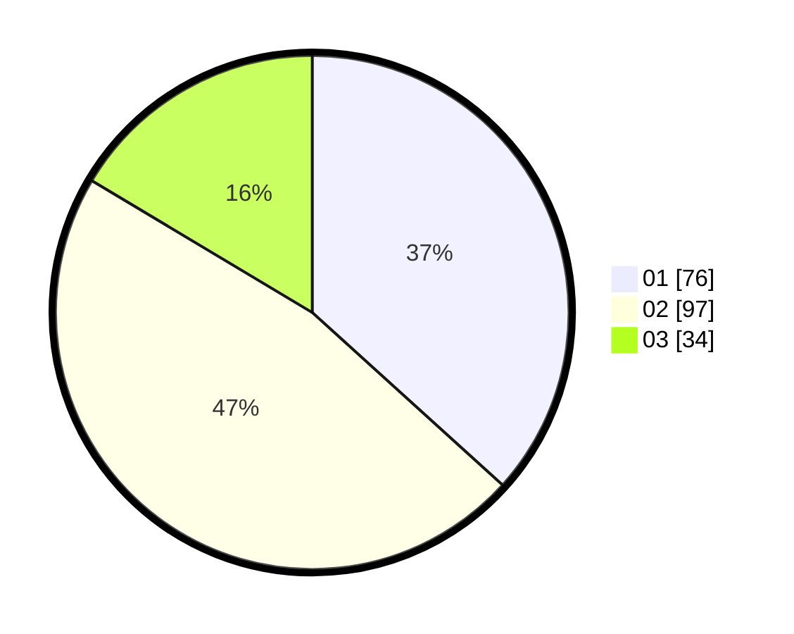

# Hasil

Hasil perolehan suara paslon dapat dilihat pada file paslon-01.txt, paslon-02.txt, dan paslon-03.txt.

Jika tidak ada, artinya data tersebut belum ada pada SIREKAP.

## Perolehan Suara

 * Paslon 01: **76**.
 * Paslon 02: **97**.
 * Paslon 03: **34**.

## Foto C Plano

https://sirekap-obj-formc.kpu.go.id/1e31/pemilu/ppwp/31/75/05/10/02/3175051002041-20240214-195456--18726e86-607f-4730-b68c-4f7e012c01aa.jpg

https://sirekap-obj-formc.kpu.go.id/1e31/pemilu/ppwp/31/75/05/10/02/3175051002041-20240214-195519--ad02da86-1295-418f-a76a-0c086c3cd652.jpg

https://sirekap-obj-formc.kpu.go.id/1e31/pemilu/ppwp/31/75/05/10/02/3175051002041-20240215-014049--20b40e30-d12a-4572-a8b4-1407de61ab15.jpg

## DATA PEMILIH TETAP

Jumlah pemilih dalam DPT: **269**.
 * L: **129**.
 * P: **140**.

## DATA PENGGUNA HAK PILIH

Jumlah pengguna hak pilih dalam DPT: **206**.
 * L: **94**.
 * P: **112**.

Jumlah pengguna hak pilih dalam DPTb: **2**.
 * L: **1**.
 * P: **1**.

Jumlah pengguna hak pilih dalam DPK: **2**.
 * L: **0**.
 * P: **2**.

Jumlah pengguna hak pilih: **210**.
 * L: **95**.
 * P: **115**.

## JUMLAH SUARA SAH DAN TIDAK SAH

JUMLAH SELURUH SUARA SAH: **207**.

JUMLAH SUARA TIDAK SAH: **3**.

JUMLAH SELURUH SUARA SAH DAN SUARA TIDAK SAH: **210**.
