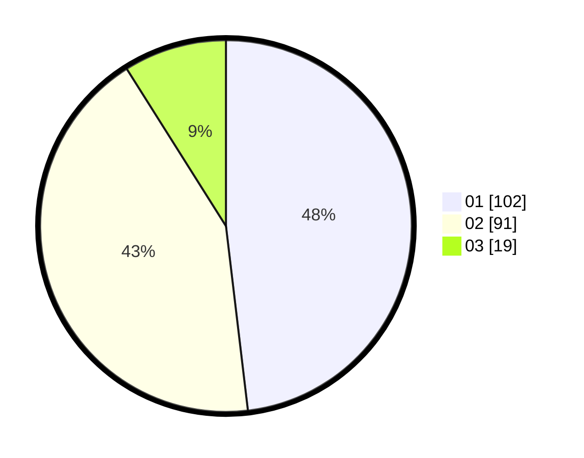

# Hasil

Hasil perolehan suara paslon dapat dilihat pada file paslon-01.txt, paslon-02.txt, dan paslon-03.txt.

Jika tidak ada, artinya data tersebut belum ada pada SIREKAP.

## Perolehan Suara

 * Paslon 01: **102**.
 * Paslon 02: **91**.
 * Paslon 03: **19**.

## Foto C Plano

https://sirekap-obj-formc.kpu.go.id/78bf/pemilu/ppwp/31/75/05/10/02/3175051002045-20240214-191919--4584d168-c170-44f0-ac85-40e02eea29eb.jpg

https://sirekap-obj-formc.kpu.go.id/78bf/pemilu/ppwp/31/75/05/10/02/3175051002045-20240214-191654--adf5c0e5-e79d-49cc-b200-db613dba787a.jpg

https://sirekap-obj-formc.kpu.go.id/78bf/pemilu/ppwp/31/75/05/10/02/3175051002045-20240214-192045--b639329c-9bf2-4998-8903-14229192a7f3.jpg
