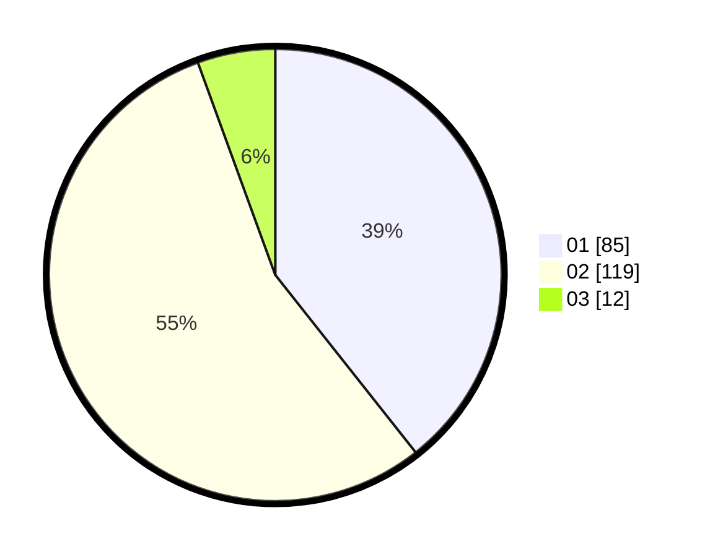

# Hasil

Hasil perolehan suara paslon dapat dilihat pada file paslon-01.txt, paslon-02.txt, dan paslon-03.txt.

Jika tidak ada, artinya data tersebut belum ada pada SIREKAP.

## Perolehan Suara

 * Paslon 01: **85**.
 * Paslon 02: **119**.
 * Paslon 03: **12**.

## Foto C Plano

https://sirekap-obj-formc.kpu.go.id/20ea/pemilu/ppwp/31/75/05/10/02/3175051002048-20240215-000650--1313b437-f86b-4ff7-8852-d4dd811135ef.jpg

https://sirekap-obj-formc.kpu.go.id/20ea/pemilu/ppwp/31/75/05/10/02/3175051002048-20240215-000904--05506732-ea23-4f1e-a150-35f9a4348620.jpg

https://sirekap-obj-formc.kpu.go.id/20ea/pemilu/ppwp/31/75/05/10/02/3175051002048-20240215-001044--6be46567-da67-474f-8d49-2f69c73cea49.jpg

## DATA PEMILIH TETAP

Jumlah pemilih dalam DPT: **260**.
 * L: **120**.
 * P: **140**.

## DATA PENGGUNA HAK PILIH

Jumlah pengguna hak pilih dalam DPT: **216**.
 * L: **100**.
 * P: **116**.

Jumlah pengguna hak pilih dalam DPTb: **6**.
 * L: **5**.
 * P: **1**.

Jumlah pengguna hak pilih dalam DPK: **1**.
 * L: **1**.
 * P: **0**.

Jumlah pengguna hak pilih: **223**.
 * L: **106**.
 * P: **117**.

## JUMLAH SUARA SAH DAN TIDAK SAH

JUMLAH SELURUH SUARA SAH: **216**.

JUMLAH SUARA TIDAK SAH: **7**.

JUMLAH SELURUH SUARA SAH DAN SUARA TIDAK SAH: **223**.
