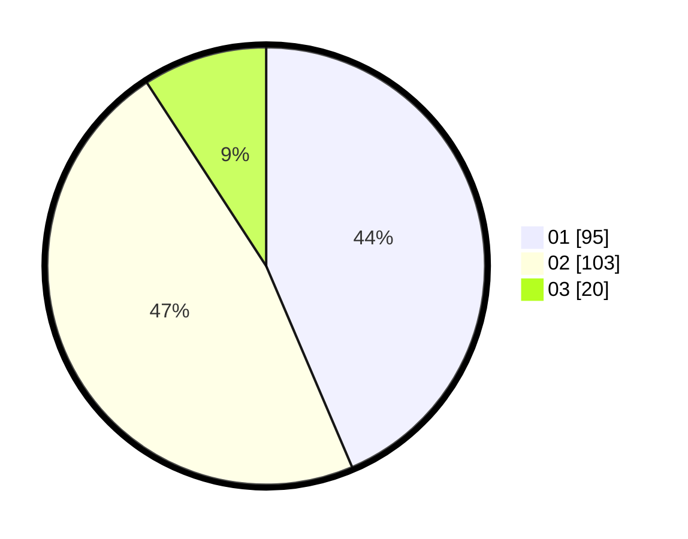

# Hasil

Hasil perolehan suara paslon dapat dilihat pada file paslon-01.txt, paslon-02.txt, dan paslon-03.txt.

Jika tidak ada, artinya data tersebut belum ada pada SIREKAP.

## Perolehan Suara

 * Paslon 01: **95**.
 * Paslon 02: **103**.
 * Paslon 03: **20**.

## Foto C Plano

https://sirekap-obj-formc.kpu.go.id/623b/pemilu/ppwp/31/75/05/10/02/3175051002052-20240215-053406--bfc90137-12ae-4efd-a325-001ad66592ba.jpg

https://sirekap-obj-formc.kpu.go.id/623b/pemilu/ppwp/31/75/05/10/02/3175051002052-20240215-033114--9a635e5c-712d-49c2-8bef-c980c916e30b.jpg

https://sirekap-obj-formc.kpu.go.id/623b/pemilu/ppwp/31/75/05/10/02/3175051002052-20240215-033637--c51b66e8-99cc-40f1-9e7b-223f3b95ca5b.jpg
