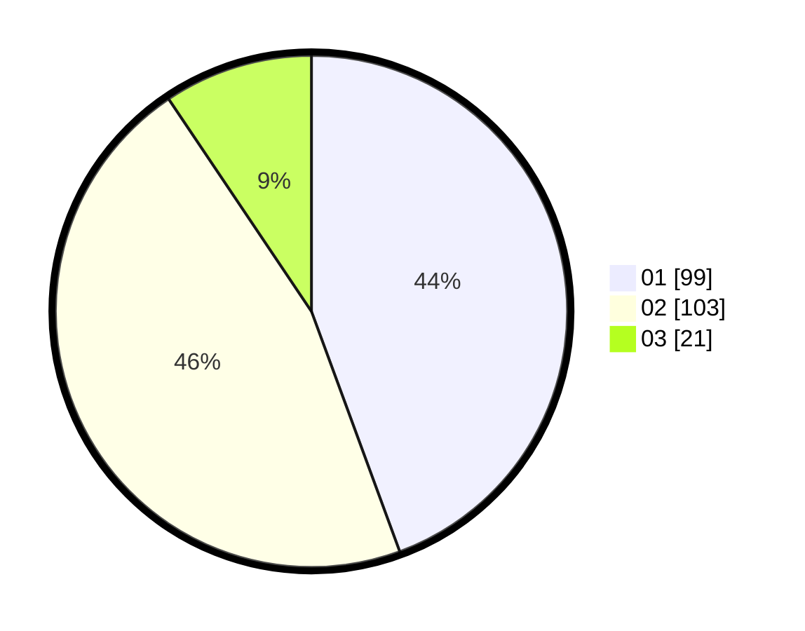

# Hasil

Hasil perolehan suara paslon dapat dilihat pada file paslon-01.txt, paslon-02.txt, dan paslon-03.txt.

Jika tidak ada, artinya data tersebut belum ada pada SIREKAP.

## Perolehan Suara

 * Paslon 01: **99**.
 * Paslon 02: **103**.
 * Paslon 03: **21**.

## Foto C Plano

https://sirekap-obj-formc.kpu.go.id/fce9/pemilu/ppwp/31/75/05/10/02/3175051002055-20240214-200300--a07ca765-1f57-455b-a405-ac1a469eeb8a.jpg

https://sirekap-obj-formc.kpu.go.id/fce9/pemilu/ppwp/31/75/05/10/02/3175051002055-20240214-204300--f5f5f93a-9be6-4e13-9520-fd843f460a95.jpg

https://sirekap-obj-formc.kpu.go.id/fce9/pemilu/ppwp/31/75/05/10/02/3175051002055-20240214-200804--007bcb98-05a1-46e9-82f1-7fa5578c6e59.jpg

## DATA PEMILIH TETAP

Jumlah pemilih dalam DPT: **272**.
 * L: **125**.
 * P: **147**.

## DATA PENGGUNA HAK PILIH

Jumlah pengguna hak pilih dalam DPT: **228**.
 * L: **103**.
 * P: **125**.

Jumlah pengguna hak pilih dalam DPTb: **0**.
 * L: **0**.
 * P: **0**.

Jumlah pengguna hak pilih dalam DPK: **0**.
 * L: **0**.
 * P: **0**.

Jumlah pengguna hak pilih: **228**.
 * L: **103**.
 * P: **125**.

## JUMLAH SUARA SAH DAN TIDAK SAH

JUMLAH SELURUH SUARA SAH: **223**.

JUMLAH SUARA TIDAK SAH: **5**.

JUMLAH SELURUH SUARA SAH DAN SUARA TIDAK SAH: **228**.
