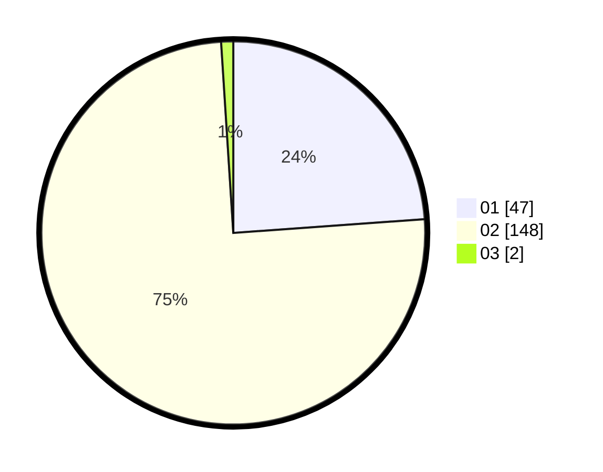

# Hasil

Hasil perolehan suara paslon dapat dilihat pada file paslon-01.txt, paslon-02.txt, dan paslon-03.txt.

Jika tidak ada, artinya data tersebut belum ada pada SIREKAP.

## Perolehan Suara

 * Paslon 01: **47**.
 * Paslon 02: **148**.
 * Paslon 03: **2**.

## Foto C Plano

https://sirekap-obj-formc.kpu.go.id/5e14/pemilu/ppwp/31/75/05/10/02/3175051002057-20240215-001832--a012ec9e-163e-4459-9a9a-6e45840e4a62.jpg

https://sirekap-obj-formc.kpu.go.id/5e14/pemilu/ppwp/31/75/05/10/02/3175051002057-20240215-002039--bac2f76a-4962-473e-906b-c8d9233f1fdf.jpg

https://sirekap-obj-formc.kpu.go.id/5e14/pemilu/ppwp/31/75/05/10/02/3175051002057-20240215-002141--2dd3807d-0ae4-43ab-b47b-03b932ba276a.jpg
