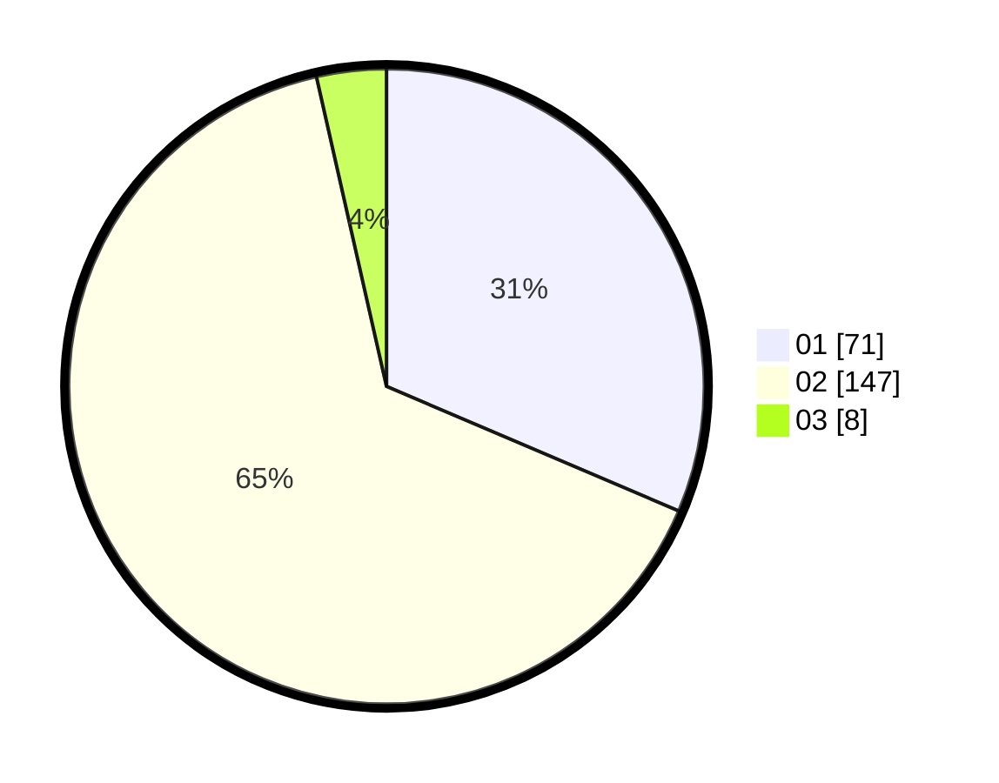

# Hasil

Hasil perolehan suara paslon dapat dilihat pada file paslon-01.txt, paslon-02.txt, dan paslon-03.txt.

Jika tidak ada, artinya data tersebut belum ada pada SIREKAP.

## Perolehan Suara

 * Paslon 01: **71**.
 * Paslon 02: **147**.
 * Paslon 03: **8**.

## Foto C Plano

https://sirekap-obj-formc.kpu.go.id/c6ae/pemilu/ppwp/31/75/05/10/02/3175051002059-20240214-232159--a9637b41-9398-4f66-a549-beab736f2f4d.jpg

https://sirekap-obj-formc.kpu.go.id/c6ae/pemilu/ppwp/31/75/05/10/02/3175051002059-20240214-212237--c0f52850-1dce-4bda-8a33-85e7a9977e02.jpg

https://sirekap-obj-formc.kpu.go.id/c6ae/pemilu/ppwp/31/75/05/10/02/3175051002059-20240214-212341--a9e2598f-1145-473d-9cf7-abe72f11bd71.jpg

## DATA PEMILIH TETAP

Jumlah pemilih dalam DPT: **282**.
 * L: **105**.
 * P: **177**.

## DATA PENGGUNA HAK PILIH

Jumlah pengguna hak pilih dalam DPT: **217**.
 * L: **73**.
 * P: **144**.

Jumlah pengguna hak pilih dalam DPTb: **0**.
 * L: **0**.
 * P: **0**.

Jumlah pengguna hak pilih dalam DPK: **11**.
 * L: **8**.
 * P: **3**.

Jumlah pengguna hak pilih: **228**.
 * L: **81**.
 * P: **147**.

## JUMLAH SUARA SAH DAN TIDAK SAH

JUMLAH SELURUH SUARA SAH: **226**.

JUMLAH SUARA TIDAK SAH: **2**.

JUMLAH SELURUH SUARA SAH DAN SUARA TIDAK SAH: **228**.
