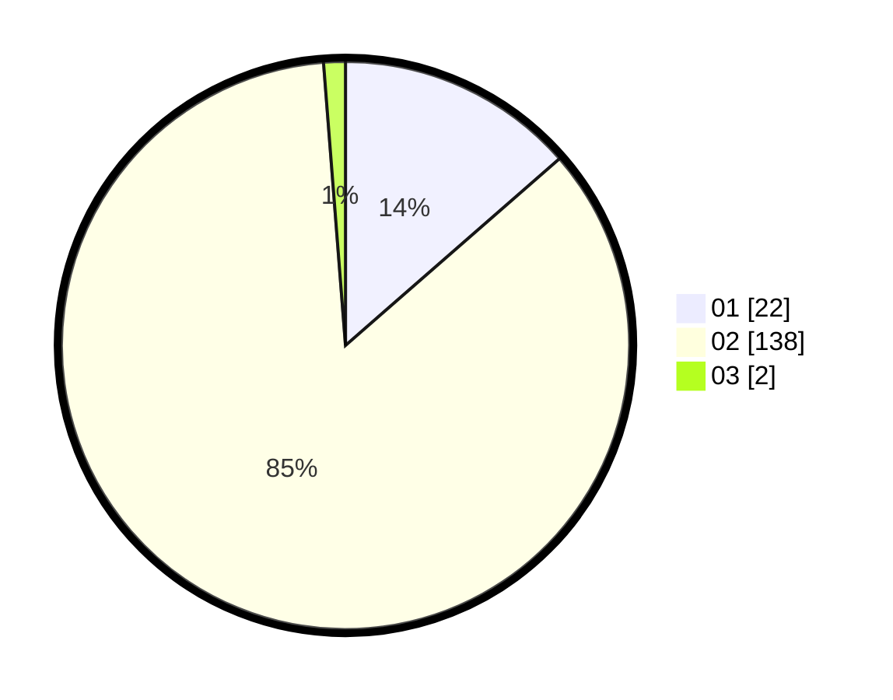

# Hasil

Hasil perolehan suara paslon dapat dilihat pada file paslon-01.txt, paslon-02.txt, dan paslon-03.txt.

Jika tidak ada, artinya data tersebut belum ada pada SIREKAP.

## Perolehan Suara

 * Paslon 01: **22**.
 * Paslon 02: **138**.
 * Paslon 03: **2**.

## Foto C Plano

https://sirekap-obj-formc.kpu.go.id/485f/pemilu/ppwp/31/75/05/10/02/3175051002063-20240215-204745--b091f66d-afc2-4c7d-b626-d5c76b22aa75.jpg

https://sirekap-obj-formc.kpu.go.id/485f/pemilu/ppwp/31/75/05/10/02/3175051002063-20240214-195811--893fbc4b-f922-46e9-a906-22a05195d849.jpg

https://sirekap-obj-formc.kpu.go.id/485f/pemilu/ppwp/31/75/05/10/02/3175051002063-20240214-194210--e3af9e64-350a-46a6-b705-cc257d9f45ed.jpg

## DATA PEMILIH TETAP

Jumlah pemilih dalam DPT: **208**.
 * L: **54**.
 * P: **154**.

## DATA PENGGUNA HAK PILIH

Jumlah pengguna hak pilih dalam DPT: **158**.
 * L: **29**.
 * P: **129**.

Jumlah pengguna hak pilih dalam DPTb: **0**.
 * L: **0**.
 * P: **0**.

Jumlah pengguna hak pilih dalam DPK: **4**.
 * L: **0**.
 * P: **4**.

Jumlah pengguna hak pilih: **162**.
 * L: **29**.
 * P: **133**.

## JUMLAH SUARA SAH DAN TIDAK SAH

JUMLAH SELURUH SUARA SAH: **162**.

JUMLAH SUARA TIDAK SAH: **0**.

JUMLAH SELURUH SUARA SAH DAN SUARA TIDAK SAH: **162**.
