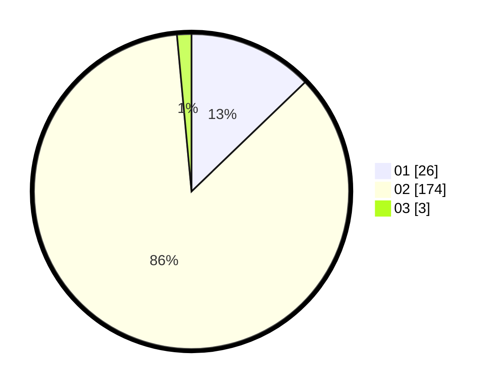

# Hasil

Hasil perolehan suara paslon dapat dilihat pada file paslon-01.txt, paslon-02.txt, dan paslon-03.txt.

Jika tidak ada, artinya data tersebut belum ada pada SIREKAP.

## Perolehan Suara

 * Paslon 01: **26**.
 * Paslon 02: **174**.
 * Paslon 03: **3**.

## Foto C Plano

https://sirekap-obj-formc.kpu.go.id/36b4/pemilu/ppwp/31/75/05/10/02/3175051002067-20240214-155030--390e11b5-300a-4c2e-aeb4-193bd83038b9.jpg

https://sirekap-obj-formc.kpu.go.id/36b4/pemilu/ppwp/31/75/05/10/02/3175051002067-20240214-155231--05f6cd6d-b67b-4231-8355-e92a157d1a26.jpg

https://sirekap-obj-formc.kpu.go.id/36b4/pemilu/ppwp/31/75/05/10/02/3175051002067-20240214-155428--1292fd89-1110-45d4-8f3b-3bdc44abd0e0.jpg

## DATA PEMILIH TETAP

Jumlah pemilih dalam DPT: **242**.
 * L: **50**.
 * P: **192**.

## DATA PENGGUNA HAK PILIH

Jumlah pengguna hak pilih dalam DPT: **189**.
 * L: **28**.
 * P: **161**.

Jumlah pengguna hak pilih dalam DPTb: **3**.
 * L: **1**.
 * P: **2**.

Jumlah pengguna hak pilih dalam DPK: **11**.
 * L: **3**.
 * P: **8**.

Jumlah pengguna hak pilih: **203**.
 * L: **32**.
 * P: **171**.

## JUMLAH SUARA SAH DAN TIDAK SAH

JUMLAH SELURUH SUARA SAH: **203**.

JUMLAH SUARA TIDAK SAH: **0**.

JUMLAH SELURUH SUARA SAH DAN SUARA TIDAK SAH: **203**.
