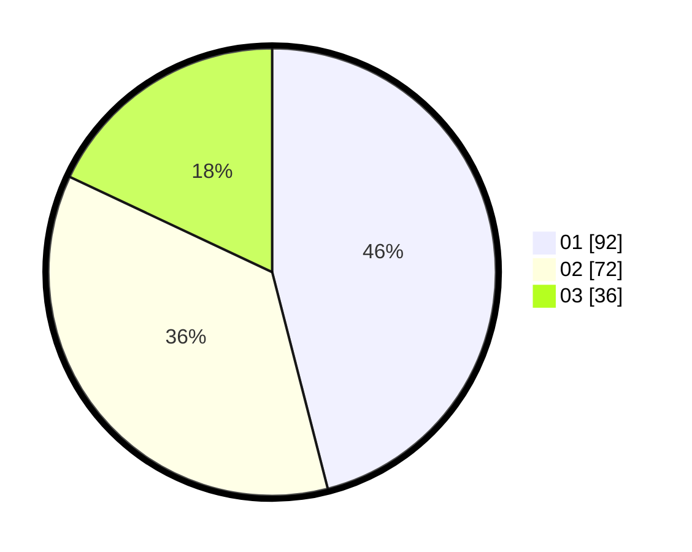

# Hasil

Hasil perolehan suara paslon dapat dilihat pada file paslon-01.txt, paslon-02.txt, dan paslon-03.txt.

Jika tidak ada, artinya data tersebut belum ada pada SIREKAP.

## Perolehan Suara

 * Paslon 01: **92**.
 * Paslon 02: **72**.
 * Paslon 03: **36**.

## Foto C Plano

https://sirekap-obj-formc.kpu.go.id/9642/pemilu/ppwp/31/75/05/10/03/3175051003010-20240214-230202--aec160b1-845c-465e-ba35-18119c07b150.jpg

https://sirekap-obj-formc.kpu.go.id/9642/pemilu/ppwp/31/75/05/10/03/3175051003010-20240214-155639--84fcb5da-b979-4420-a4c9-d00e0ef9a0f5.jpg

https://sirekap-obj-formc.kpu.go.id/9642/pemilu/ppwp/31/75/05/10/03/3175051003010-20240214-160059--671448ec-d463-4d09-96ce-f913cfe37a56.jpg
