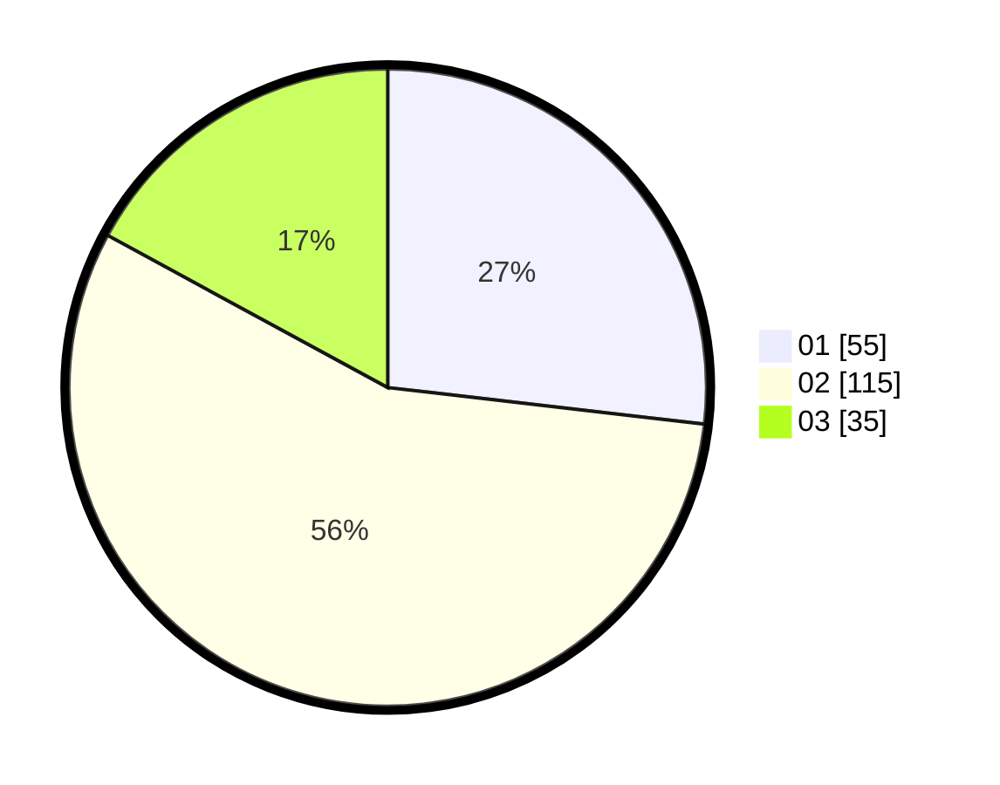

# Hasil

Hasil perolehan suara paslon dapat dilihat pada file paslon-01.txt, paslon-02.txt, dan paslon-03.txt.

Jika tidak ada, artinya data tersebut belum ada pada SIREKAP.

## Perolehan Suara

 * Paslon 01: **55**.
 * Paslon 02: **115**.
 * Paslon 03: **35**.

## Foto C Plano

https://sirekap-obj-formc.kpu.go.id/6dfa/pemilu/ppwp/31/75/05/10/03/3175051003011-20240214-184915--2d36de21-12bf-4011-b9a3-f692392c677d.jpg

https://sirekap-obj-formc.kpu.go.id/6dfa/pemilu/ppwp/31/75/05/10/03/3175051003011-20240214-184923--86c93338-267c-4533-a7ed-8d4f91bfa20c.jpg

https://sirekap-obj-formc.kpu.go.id/6dfa/pemilu/ppwp/31/75/05/10/03/3175051003011-20240214-184903--a49a28a0-3da4-4ffc-a12d-ff2798ae6362.jpg

## DATA PEMILIH TETAP

Jumlah pemilih dalam DPT: **205**.
 * L: **97**.
 * P: **108**.

## DATA PENGGUNA HAK PILIH

Jumlah pengguna hak pilih dalam DPT: **202**.
 * L: **96**.
 * P: **106**.

Jumlah pengguna hak pilih dalam DPTb: **2**.
 * L: **1**.
 * P: **1**.

Jumlah pengguna hak pilih dalam DPK: **3**.
 * L: **1**.
 * P: **2**.

Jumlah pengguna hak pilih: **207**.
 * L: **98**.
 * P: **109**.

## JUMLAH SUARA SAH DAN TIDAK SAH

JUMLAH SELURUH SUARA SAH: **205**.

JUMLAH SUARA TIDAK SAH: **2**.

JUMLAH SELURUH SUARA SAH DAN SUARA TIDAK SAH: **207**.
