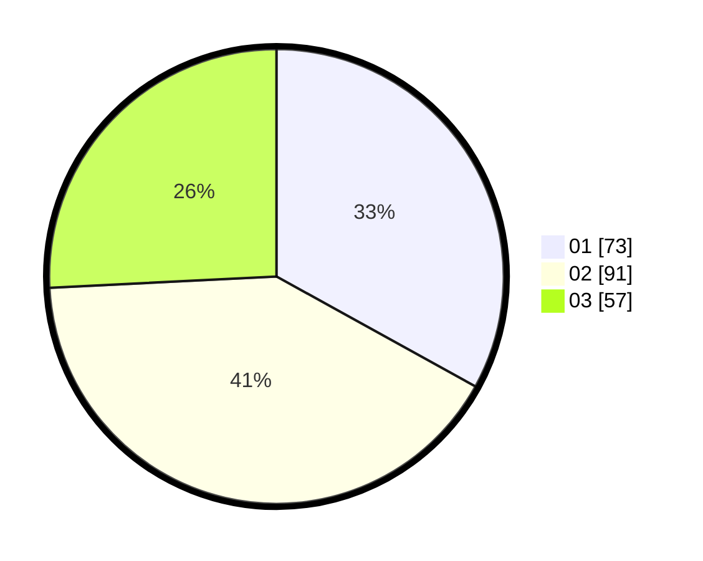

# Hasil

Hasil perolehan suara paslon dapat dilihat pada file paslon-01.txt, paslon-02.txt, dan paslon-03.txt.

Jika tidak ada, artinya data tersebut belum ada pada SIREKAP.

## Perolehan Suara

 * Paslon 01: **73**.
 * Paslon 02: **91**.
 * Paslon 03: **57**.

## Foto C Plano

https://sirekap-obj-formc.kpu.go.id/9fa4/pemilu/ppwp/31/75/05/10/03/3175051003015-20240214-191312--71163b3b-dd5c-4149-bf6f-d1450eb23719.jpg

https://sirekap-obj-formc.kpu.go.id/9fa4/pemilu/ppwp/31/75/05/10/03/3175051003015-20240214-191455--fbec7643-2b38-4ea5-8159-da2fe099aedc.jpg

https://sirekap-obj-formc.kpu.go.id/9fa4/pemilu/ppwp/31/75/05/10/03/3175051003015-20240214-191638--a279a3d4-37dd-46c4-96af-f67361e2e7a0.jpg
