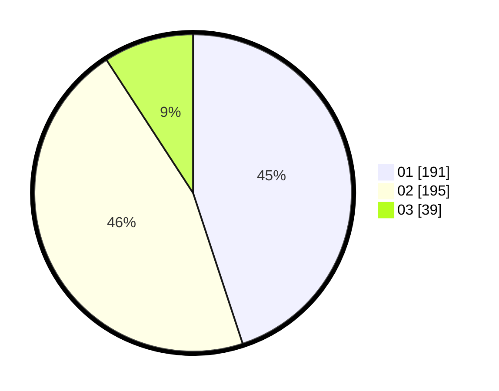

# Hasil

Hasil perolehan suara paslon dapat dilihat pada file paslon-01.txt, paslon-02.txt, dan paslon-03.txt.

Jika tidak ada, artinya data tersebut belum ada pada SIREKAP.

## Perolehan Suara

 * Paslon 01: **191**.
 * Paslon 02: **195**.
 * Paslon 03: **39**.

## Foto C Plano

https://sirekap-obj-formc.kpu.go.id/a42b/pemilu/ppwp/31/75/05/10/03/3175051003022-20240215-003417--07ae25f5-e0bc-41f7-8e34-c215dcb36b64.jpg

https://sirekap-obj-formc.kpu.go.id/a42b/pemilu/ppwp/31/75/05/10/03/3175051003022-20240215-003552--02513d79-4701-44eb-8859-8bbb9a93c849.jpg

https://sirekap-obj-formc.kpu.go.id/a42b/pemilu/ppwp/31/75/05/10/03/3175051003022-20240215-003708--53e49e59-d4e2-43a1-9b55-3525c11f1a2a.jpg
